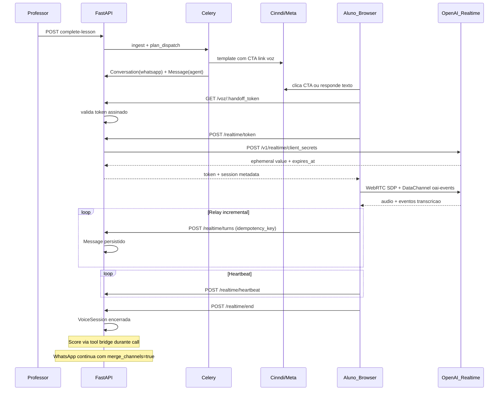
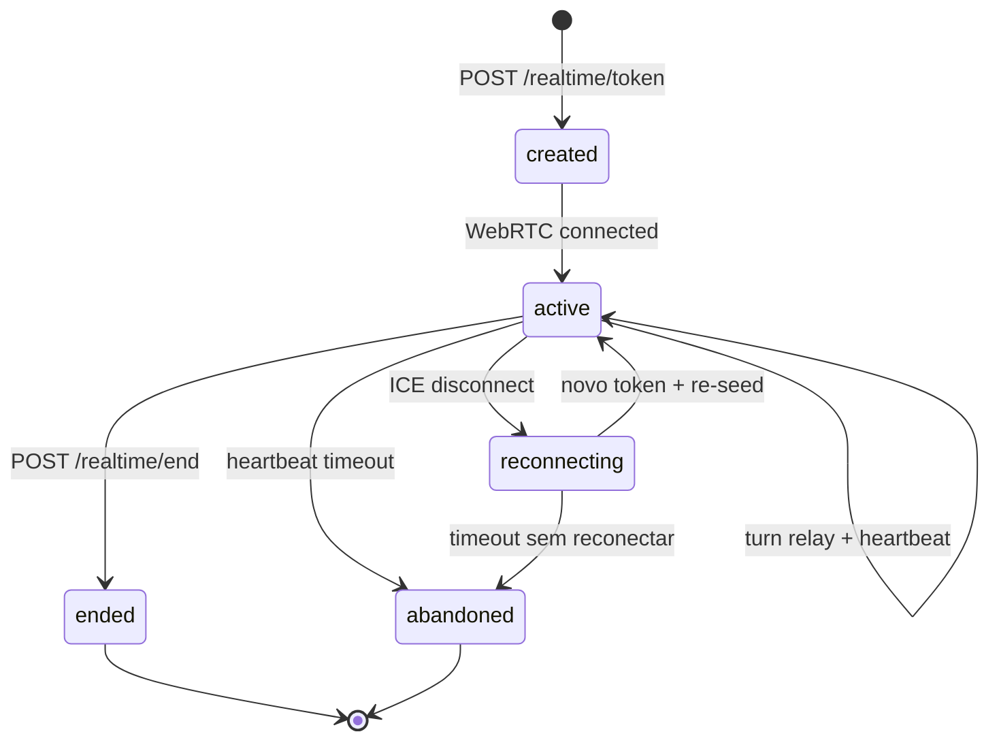

# Plano: Canal de Voz Realtime no CertAI

## 1. Visão da arquitetura



**Padrão de referência:** handshake WebRTC do [helena-rails `openai_realtime_service.rb`](helena-rails/app/services/openai_realtime_service.rb) + [`DashboardContext.jsx`](helena-rails/frontend/src/contexts/DashboardContext.jsx). **Doc GA vence:** `POST /v1/realtime/client_secrets` com `{ session: { type: "realtime", model, audio, instructions, tools } }`, browser conecta em `POST /v1/realtime/calls` com Bearer ephemeral.

**Decisões arquiteturais fixas (da Fase 0 + revisão):**
- WebRTC browser ↔ OpenAI direto; backend nunca vê áudio
- TTS nativo OpenAI (`audio.output.voice`) — sem proxy ElevenLabs
- Uma `Conversation` com `channel=realtime_voice` por `(cohort, user, lesson)`
- Cross-channel via `merged_lesson_history` em todos os canais
- **Modelo Realtime:** `gpt-realtime-2` (paridade com helena-rails produção; upgrade depois)
- **Voz da Lira:** `coral` (default helena-rails); validar ao vivo na Etapa A (trocar é trivial via ENV)
- **Humanizer:** NÃO aplicar no path de voz — tom direto da Realtime (latência é prioridade)
- **URL da página de voz:** mesmo domínio do frontend, rota pública `/voz/:token` (sem subdomínio)
- **Execução:** uma etapa por vez; implementar somente a etapa pedida explicitamente

---

## 2. Modelo de dados

### 2.1 Alterações no enum `ConversationChannel`

Arquivo: [`backend/app/models/conversation.py`](certai-python/backend/app/models/conversation.py)

```python
class ConversationChannel(str, enum.Enum):
    IN_APP = "in_app"
    WHATSAPP = "whatsapp"
    REALTIME_VOICE = "realtime_voice"  # novo
```

Migration `009_realtime_voice.py`: adicionar valor ao enum PostgreSQL (aditivo, sem quebrar existentes).

### 2.2 Novo campo `source` em `Message` (discriminador fino)

O princípio pede `whatsapp_text`, `whatsapp_audio`, `realtime_voice`. Canal fica em `Conversation`; `source` fica em `Message`:

```python
class MessageSource(str, enum.Enum):
    WHATSAPP_TEXT = "whatsapp_text"
    WHATSAPP_AUDIO = "whatsapp_audio"   # transcrito via Groq
    REALTIME_VOICE = "realtime_voice"
    IN_APP_TEXT = "in_app_text"
```

Migration: coluna `messages.source` nullable (backfill: whatsapp → `whatsapp_text`, in_app → `in_app_text`).

### 2.3 Nova entidade `VoiceSession` (lifecycle da call)

Arquivo novo: `backend/app/models/voice_session.py`

| Campo | Tipo | Descrição |
|-------|------|-----------|
| `id` | UUID PK | |
| `conversation_id` | FK conversations | Amarra à sessão de aula |
| `status` | enum | `created`, `active`, `reconnecting`, `ended`, `abandoned` |
| `lock_token` | str unique | Token de lock (padrão helena) |
| `lock_expires_at` | datetime | TTL renovável |
| `started_at` | datetime | |
| `last_heartbeat_at` | datetime | |
| `ended_at` | datetime nullable | |
| `end_reason` | str nullable | `explicit`, `timeout`, `token_expired`, `replaced` |

Regra: **uma VoiceSession ativa por conversation**; reconexão encerra a anterior (`replaced`) e cria nova com contexto re-seedado.

### 2.4 Idempotência em `Message`

Nova coluna `messages.idempotency_key` (str, unique, nullable):
- WhatsApp: continua usando `provider_message_id`
- Realtime: `idempotency_key = f"{voice_session_id}:{event_item_id}"` vindo do browser

### 2.5 Handoff token (sem tabela)

JWT assinado com `SECRET_KEY`, tipo `voice_handoff`, payload:
```json
{ "sub": "user_id", "cohort_id": "...", "lesson_id": "...", "conversation_id": "...", "type": "voice_handoff", "exp": "...", "jti": "..." }
```

**Política de expiração e reuso (corrigida):**
- **Expiração: 48h** — o token é gerado no dispatch e embutido na URL do template; o aluno pode clicar horas ou dias depois
- **Reuso PERMITIDO** dentro da janela — fechar e reabrir a página não invalida o link
- **`jti` no Redis:** anti-replay de sessão **concorrente**, NÃO consumo único. TTL = 48h (alinhado ao `exp`)
- **Sessões simultâneas:** bloqueadas pelo **lock da VoiceSession** (`lock_token`), não pelo handoff token

Serviço: `backend/app/services/realtime/handoff_token_service.py`

---

## 3. Backend (FastAPI) — endpoints novos

Router: `backend/app/api/v1/realtime.py` (prefixo `/api/v1/realtime`)

### 3.1 `POST /realtime/handoff/generate` (interno — chamado no dispatch)

Chamado por [`dispatch_service.py`](certai-python/backend/app/services/whatsapp/dispatch_service.py) ao montar o link do template. Não exposto ao browser.

**Request:** `{ cohort_id, user_id, lesson_id }`  
**Response:** `{ url: "https://<FRONTEND_BASE_URL>/voz/<token>", token, expires_at }` (token válido por 48h, reusável)

### 3.2 `GET /voz/:token` (página React — rota frontend)

Frontend valida visualmente; backend expõe:

### 3.3 `POST /realtime/session/validate`

Valida handoff token sem consumir (read-only check para UI).

**Request:** `{ handoff_token }`  
**Response:** `{ valid, student_first_name, lesson_title, track_title, assistant_name, expires_at }`  
**Errors:** 401 expired (após 48h)

Validação read-only — **não consome** o token. Reuso do mesmo link é esperado.

### 3.4 `POST /realtime/token`

Gera ephemeral OpenAI + cria/reativa VoiceSession.

**Request:**
```json
{
  "handoff_token": "eyJ...",
  "reconnect_from_session_id": "uuid|null"
}
```

**Response:**
```json
{
  "ephemeral_token": "ek_...",
  "expires_at": 1234567890,
  "voice_session_id": "uuid",
  "lock_token": "uuid",
  "realtime_model": "gpt-realtime-2",
  "realtime_voice": "coral",
  "play_session_opener": true
}
```

**Lógica:**
1. Validar handoff token (assinatura + `exp`; **não** consumir `jti` — reuso permitido)
2. `get_or_create_conversation(..., channel=REALTIME_VOICE)`
3. Adquirir lock (`VoiceSessionLockService` — copiar padrão de [`helena-rails session_realtime_lock_service.rb`](helena-rails/app/services/session_realtime_lock_service.rb); 409 se outra aba/dispositivo já tem sessão ativa)
4. Montar instructions via `RealtimeInstructionsBuilder` (ver seção 6)
5. `OpenaiRealtimeService.create_client_secret(instructions, tools)` com `OpenAI-Safety-Identifier` = hash(user_id)
6. Retornar token

Serviço: `backend/app/services/realtime/openai_realtime_service.py` (port do helena)

### 3.5 `POST /realtime/turns` — ingestão incremental

**Request:**
```json
{
  "voice_session_id": "uuid",
  "lock_token": "uuid",
  "turns": [
    {
      "idempotency_key": "vs_id:item_abc",
      "author": "student|agent",
      "content": "transcricao ou texto da Lira",
      "realtime_item_id": "item_abc",
      "sequence": 1
    }
  ]
}
```

**Response:** `{ accepted: 2, duplicates: 0, conversation_id }`

**Lógica:**
- Validar lock ativo
- `record_message` com dedup por `idempotency_key` (ON CONFLICT DO NOTHING ou check prévio)
- `source = REALTIME_VOICE`
- Atualizar `conversation.updated_at` (importante para roteamento WhatsApp)

### 3.6 `POST /realtime/heartbeat`

**Request:** `{ voice_session_id, lock_token }`  
**Response:** `{ ok: true }` ou 409 lock inválido

Renova `last_heartbeat_at` + `lock_expires_at`. Ausência > 90s sem heartbeat e sem `POST /realtime/end` → job Celery marca `abandoned`.

### 3.7 `POST /realtime/end`

**Request:**
```json
{
  "voice_session_id": "uuid",
  "lock_token": "uuid",
  "reason": "explicit",
  "final_sequence": 12
}
```

**Response:** `{ ok: true, status: "ended", turn_count: 12 }`

Valida integridade (contagem de turnos vs `final_sequence`), libera lock, status → `ended`.

### 3.8 `POST /realtime/tools/{tool_name}` — bridge de tools

Lock-protegido. Executa `escalate_scope` e `score_understanding` server-side reutilizando [`tools.py`](certai-python/backend/app/ai/tools.py) `dispatch()`.

**Request:** `{ voice_session_id, lock_token, call_id, arguments: {...} }`  
**Response:** `{ call_id, output: "texto para function_call_output" }`

Tools expostos no `client_secret` (formato Realtime GA, não Chat Completions):
- `score_understanding` — mesma semântica
- `escalate_scope` — retorna blocos de contexto; cliente reenvia via data channel como `function_call_output`, depois `response.create`
- `end_conversation` — cliente desconecta WebRTC

### 3.9 Alteração no fluxo WhatsApp existente

Em [`generate_lesson_reply`](certai-python/backend/app/services/conversation_service.py): **mudar default de `merge_channels` para `True`** no path WhatsApp (`tasks.py` `_process_whatsapp_inbound`). Garante princípio 4 sem alterar score.

Em [`inbound_service.py`](certai-python/backend/app/services/whatsapp/inbound_service.py): ao persistir, setar `source=WHATSAPP_TEXT` ou `WHATSAPP_AUDIO` conforme tipo da mensagem.

---

## 4. Frontend (React)

### 4.1 Nova rota pública

Em [`App.tsx`](certai-python/frontend/src/App.tsx), **fora** de `ProtectedRoute`:

```
/voz/:handoffToken
```

Página: `frontend/src/pages/VoiceSession.tsx`

### 4.2 Componentes

| Arquivo | Responsabilidade |
|---------|------------------|
| `frontend/src/hooks/useRealtimeVoice.ts` | WebRTC lifecycle (port de `DashboardContext.connectRealtime`) |
| `frontend/src/lib/realtimeApi.ts` | Chamadas aos endpoints `/realtime/*` |
| `frontend/src/components/voice/VoiceCallUI.tsx` | Estado conexão, indicador fala, botão encerrar |
| `frontend/src/lib/sessionRealtimeLock.ts` | Lock token em sessionStorage (copiar helena) |

### 4.3 Fluxo da página

1. Extrair `handoffToken` da URL
2. `POST /realtime/session/validate` → mostrar contexto (aula, Lira)
3. Pedir permissão de microfone
4. `POST /realtime/token` → ephemeral token
5. WebRTC: `RTCPeerConnection` + `createDataChannel('oai-events')` + SDP → `api.openai.com/v1/realtime/calls`
6. DataChannel handlers:
   - `conversation.item.input_audio_transcription.completed` → acumular transcript aluno
   - `response.done` → extrair texto assistente + function calls
   - Function calls → `POST /realtime/tools/{name}` → `conversation.item.create` com `function_call_output` → `response.create`
   - Após turno completo → `POST /realtime/turns` (relay incremental, **não esperar fim da call**)
7. Heartbeat a cada 30s
8. Encerrar → `POST /realtime/end` + `disconnectRealtime()`
9. Fallback UI: "Sem microfone? Continue pelo WhatsApp" com link `wa.me/...`

### 4.4 Tratamento de erros

| Cenário | UX |
|---------|-----|
| Token expirado (>48h) | Mensagem + "Volte ao WhatsApp e peça novo link" |
| Browser sem WebRTC | Fallback WhatsApp |
| Permissão mic negada | Instruções + fallback |
| Lock 409 (outra aba) | "Sessão aberta em outro dispositivo" |
| Rede caiu | Auto-reconnect: novo `POST /realtime/token` com `reconnect_from_session_id` |

### 4.5 Mobile-first

- UI fullscreen, botões grandes, sem dependência de hover
- `getUserMedia` com `echoCancellation` + `noiseSuppression`
- Testar iOS Safari (autoplay policy: `audioElement.autoplay = true` no `pc.ontrack`)

---

## 5. Ciclo de vida da sessão de voz



| Transição | Persistido |
|-----------|------------|
| `created → active` | VoiceSession.status, started_at |
| Cada turno | Message(student/agent) via relay |
| Tool score | MicroScore (inalterado) |
| `active → reconnecting` | VoiceSession.status; turnos já salvos permanecem |
| Reconexão | Nova VoiceSession; instructions re-montadas com histórico completo |
| `→ ended` | ended_at, end_reason; validação de sequência |
| `→ abandoned` | ended_at, end_reason=timeout; score trabalha com turnos parciais |

**Reconexão:** browser chama `POST /realtime/token` com `reconnect_from_session_id`. Backend encerra sessão anterior (`replaced`), cria nova, monta instructions com todos os turnos persistidos (WhatsApp + voz anterior + parcial).

**Coexistência com WhatsApp:** mesma aula pode ter `Conversation(WHATSAPP)` e `Conversation(REALTIME_VOICE)` simultaneamente. `merged_lesson_history` unifica para contexto. Score não distingue canal.

---

## 6. Montagem de contexto da sessão de voz

Serviço novo: `backend/app/services/realtime/instructions_builder.py`

### 6.1 Fonte única da persona (princípio 5)

```python
async def build(cohort_id, lesson_id, student_id) -> str:
    bundle = await ContextBuilder(db).build_lesson(cohort_id, lesson_id)
    system_blocks = bundle.to_system_blocks()
    history = await merged_lesson_history(db, cohort_id, student_id, lesson_id)

    return f"""{SYSTEM_BASE}

{system_blocks}

## Modo de conversa
Você está em uma chamada de voz ao vivo. Respostas curtas e naturais para fala.
Não use markdown, listas longas ou formatação. Uma ideia por vez.

## Histórico da conversa desta aula
{format_history(history)}

## Abertura
Cumprimente o aluno pelo nome e retome de onde a conversa parou.
Não recomece do zero se já houve troca de mensagens."""
```

Reutiliza `SYSTEM_BASE` de [`engine.py`](certai-python/backend/app/ai/engine.py) e `ContextBuilder` — **sem duplicar persona**.

### 6.2 Mecanismo de injeção

**Primário: `instructions` no `client_secrets`** (padrão helena, confirmado na doc GA).

**Secundário (opcional):** `conversation.item.create` com mensagens iniciais para os últimos 3–5 turnos se couber no budget — só se instructions truncadas.

### 6.3 Truncamento

| Limite | Estratégia |
|--------|------------|
| Instructions > ~25k chars | Manter `SYSTEM_BASE` + `bundle` completo; truncar histórico para últimos 20 turnos |
| Ainda excede | Sumarizar turnos antigos via LLM (reutilizar padrão de ingestion) em bloco `## Resumo da conversa anterior` |
| Reconexão | Sempre re-fetch histórico do DB (fonte de verdade) |

### 6.4 Tools no session config

Portar schemas de [`tools.py`](certai-python/backend/app/ai/tools.py) para formato Realtime GA (`type: function, name, description, parameters`) + `end_conversation`. **Não** incluir humanizer no path de voz.

### 6.5 Session opener

Enviar `response.create` no `dc.onopen` (padrão helena) para Lira cumprimentar sem esperar o aluno falar primeiro.

---

## 7. Integração com o score

**Nenhuma alteração no pipeline de score.** `score_understanding` continua gravando `MicroScore` via tool bridge.

Fluxo durante call:
1. Realtime emite `response.done` com function call `score_understanding`
2. Browser → `POST /realtime/tools/score_understanding`
3. Backend executa `_score_understanding` de [`tools.py`](certai-python/backend/app/ai/tools.py)
4. Browser envia `function_call_output` no data channel
5. Browser envia `response.create` para Lira continuar falando

**Batch `evaluate_cohort_gaps`:** inalterado — lê `MicroScore`, não conversas.

**Garantia channel-agnostic:** evidence no score cita o que o aluno disse (transcrição relayada); canal irrelevante.

---

## 8. Alteração do template WhatsApp

Novo template (submeter à Meta para aprovação): `certai_convite_aula_voz`

```
Oi {{1}}! 👋 Aqui é a {{4}}, sua parceira de estudos no CertAI.
Quero conversar com você sobre a aula "{{2}}" da trilha "{{3}}".

🎙️ Prefere falar comigo ao vivo? Toque no botão abaixo.
Ou responda por aqui, texto ou áudio — como preferir. 🙂
```

| Variável | Conteúdo |
|----------|----------|
| `{{1}}` | Primeiro nome |
| `{{2}}` | Título da aula |
| `{{3}}` | Título da trilha |
| `{{4}}` | ASSISTANT_NAME |

**Botão URL (CTA):** `Falar com a Lira` → `https://<FRONTEND_BASE_URL>/voz/{{5}}` onde `{{5}}` é o handoff token gerado no dispatch. Mesmo domínio do frontend — sem subdomínio.

Alterações em [`dispatch_service.py`](certai-python/backend/app/services/whatsapp/dispatch_service.py):
- Gerar handoff token por aluno (48h, reusável)
- Incluir URL no template (6ª variável ou botão URL conforme API Cinndi suportar)
- Manter texto fallback para quem responde no chat

**Submissão Meta (ação paralela ao desenvolvimento):** submeter `certai_convite_aula_voz` com botão URL **já**, em paralelo às Etapas A–D — aprovação leva dias e a Etapa E é a última. Manter `certai_convite_aula` original como fallback até aprovação.

> **Atualização pós-Etapa E:** template em produção = **`certai_convite_aula_voz_v2`** (APPROVED). Cinndi usa `botoesURL` na criação (`url` **sem** barra final: `https://app.certai.com.br/voz`) e `buttons` (string) no envio. O v1 (`certai_convite_aula_voz`) registrou `voz//{{1}}` por barra final no prefixo — legado, não usar. Ver [`whatsapp-template-certai_convite_aula.md`](whatsapp-template-certai_convite_aula.md) e [`doc-template-cinndi.md`](doc-template-cinndi.md).

Doc: atualizar [`docs/whatsapp-template-certai_convite_aula.md`](certai-python/docs/whatsapp-template-certai_convite_aula.md) com variante voz.

---

## 9. Fases de execução

**Regra de execução:** implementar **uma etapa por vez**, somente quando pedida explicitamente. Não avançar para a próxima etapa sem aprovação.

**Ação paralela (não bloqueia Etapa A):** submeter template `certai_convite_aula_voz` à Meta/Cinndi para aprovação do botão URL.

### Etapa A — Ephemeral token + página hardcoded (ponta a ponta)
**Arquivos:** `openai_realtime_service.py`, `realtime.py` (só `/token` com IDs hardcoded), `VoiceSession.tsx`, `useRealtimeVoice.ts`

**Defaults:** modelo `gpt-realtime-2`, voz `coral` (helena-rails). Validar voz ao vivo; trocar via ENV se necessário.

**Pronto quando:** browser conecta WebRTC, Lira fala, transcrições aparecem no console.

### Etapa B — Handoff token + rota pública
**Arquivos:** `handoff_token_service.py`, `/session/validate`, rota `/voz/:token`

**Pronto quando:** link com token válido abre página e inicia call sem login.

### Etapa C — Persistência de turnos
**Arquivos:** migration `source` + `idempotency_key`, `VoiceSession` model, `/turns`, `/heartbeat`, `/end`

**Pronto quando:** turnos sobrevivem a refresh da página; dedup funciona em reenvio.

### Etapa D — Contexto cross-channel + tools
**Arquivos:** `instructions_builder.py`, tool bridge, `merge_channels=True` no WhatsApp

**Pronto quando:** conversa WhatsApp → voz retoma contexto; score grava durante call; volta ao WhatsApp com histórico da voz.

### Etapa E — Template + dispatch
**Arquivos:** `dispatch_service.py`, doc template, ENV `FRONTEND_BASE_URL` (mesmo domínio do frontend)

**Pronto quando:** professor completa aula → aluno recebe template com CTA → clica → call funciona. Depende da aprovação Meta do template submetido em paralelo.

### Etapa F — Hardening mobile + abandon timeout
**Arquivos:** Celery beat job para abandoned sessions, testes, fallback UI

**Pronto quando:** sessão abandonada após 90s sem heartbeat; iOS Safari funciona.

---

## 10. Riscos e pontos de atenção

| Risco | Mitigação |
|-------|-----------|
| Tab morta no mobile (iOS/Android) | Relay incremental por turno; nunca buffer local |
| Custo Realtime API | Monitorar duração; `end_conversation` tool; timeout abandon |
| Limite de sessão OpenAI | Reconexão com novo token; não depender de sessão longa |
| Qualidade transcrição pt-BR | `audio.input.transcription` com `language: pt`; modelo `gpt-4o-mini-transcribe` |
| Race transcript vs response.done | `awaitTranscriptIfEmpty(800ms)` (padrão helena) antes de relay |
| Template Meta rejeitado | Manter template atual sem botão; link no corpo do texto como fallback |
| WhatsApp roteamento "última conversa" | Mitigação: atualizar `updated_at` em cada turno relayado de voz. **Débito técnico** — correção do roteamento inbound fora do escopo |
| Instructions estouram limite | Truncamento + sumário (seção 6.3) |
| Score duplicado em reconnect | Idempotência no tool bridge não necessária (score é intencionalmente esparso) |
| Humanizer ausente na voz | **Decisão:** não aplicar — tom direto da Realtime (latência é prioridade) |
| Handoff token expira antes do clique | **Decisão:** expiração 48h (gerado no dispatch, clicado dias depois) |

---

## 11. Decisões tomadas (ex-perguntas abertas)

| # | Decisão |
|---|---------|
| 1 | **URL base:** mesmo domínio do frontend; rota pública `/voz/:token` no `App.tsx` |
| 2 | **Handoff token:** expiração **48h**; **reuso permitido**; lock da VoiceSession impede sessões simultâneas |
| 3 | **Template Meta:** submeter `certai_convite_aula_voz` com botão URL **em paralelo** ao dev; manter template atual como fallback |
| 4 | **Voz da Lira:** começar com `coral` (helena-rails); decidir final testando ao vivo na Etapa A |
| 5 | **Modelo Realtime:** `gpt-realtime-2` (helena-rails produção); upgrade depois |
| 6 | **Roteamento WhatsApp inbound:** **fora do escopo**; mitigação via `updated_at`; registrar como débito técnico |
| 7 | **Humanizer na voz:** **não aplicar**; aceitar tom direto da Realtime |

### Débito técnico registrado

- **WhatsApp inbound routing:** hoje roteia para a última conversa WhatsApp do aluno (`updated_at DESC`), não por `(user_id, lesson_id)`. Correção adiada; mitigação: atualizar `conversation.updated_at` em cada relay de turno de voz.

---

## Arquivos principais a criar/alterar

**Criar:**
- `backend/app/services/realtime/openai_realtime_service.py`
- `backend/app/services/realtime/instructions_builder.py`
- `backend/app/services/realtime/handoff_token_service.py`
- `backend/app/services/realtime/voice_session_service.py`
- `backend/app/models/voice_session.py`
- `backend/app/api/v1/realtime.py`
- `backend/alembic/versions/009_realtime_voice.py`
- `frontend/src/pages/VoiceSession.tsx`
- `frontend/src/hooks/useRealtimeVoice.ts`
- `frontend/src/lib/realtimeApi.ts`
- `frontend/src/components/voice/VoiceCallUI.tsx`

**Alterar:**
- [`conversation.py`](certai-python/backend/app/models/conversation.py) — enum + MessageSource
- [`conversation_service.py`](certai-python/backend/app/services/conversation_service.py) — merge_channels default, source em record_message
- [`dispatch_service.py`](certai-python/backend/app/services/whatsapp/dispatch_service.py) — handoff link
- [`tasks.py`](certai-python/backend/app/workers/tasks.py) — merge_channels=True, job abandon
- [`App.tsx`](certai-python/frontend/src/App.tsx) — rota pública
- [`config.py`](certai-python/backend/app/core/config.py) — ENV: `OPENAI_REALTIME_MODEL=gpt-realtime-2`, `OPENAI_REALTIME_VOICE=coral`, `FRONTEND_BASE_URL`, `VOICE_HANDOFF_EXPIRE_HOURS=48`
- [`docs/whatsapp-template-certai_convite_aula.md`](certai-python/docs/whatsapp-template-certai_convite_aula.md)
