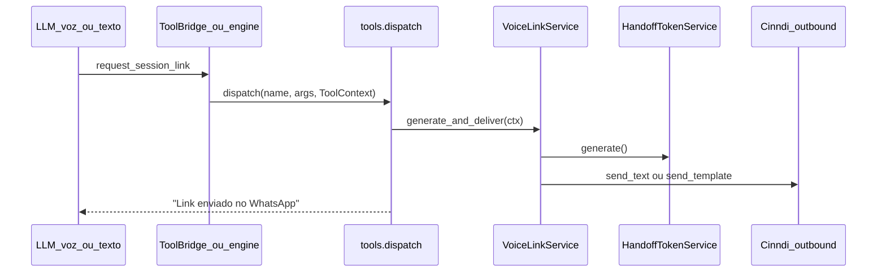

# Plano: Reconexão de voz, persuasão e link sob demanda

**Projeto:** `certai-python` · branch `feat-realtime-v2`  
**Referência (somente leitura):** [`realtime_voice_channel_6e560811.plan.md`](realtime_voice_channel_6e560811.plan.md)  
**Princípio inegociável:** inteligência no backend; realtime = transporte; intenção = LLM + tools (mesmo padrão de `score_understanding` / `escalate_scope`).

**Decisão de arquitetura (handoff JWT):** **NÃO reusar token.** Cada pedido de link gera um **novo** JWT via `HandoffTokenService.generate()`. Expiração via `VOICE_HANDOFF_EXPIRE_HOURS` (default 48h). Sem registro Redis/DB de tokens emitidos.

**Regra de execução:** implementar **uma etapa por vez**, somente quando pedida explicitamente. Fase 1A é independente e pode ser executada e testada antes de 1B+1C.

---

## Fase 0 — Relatório de investigação (I1–I5)

### I1 — Unificação voz + WhatsApp para “gerar/enviar link”

**Maior incógnita resolvida:** os dois cérebros **já compartilham** a camada de tools; o que falta é a tool de link e o serviço de entrega.

| Aspecto | Existe hoje | Falta |
|---------|-------------|-------|
| WhatsApp texto tem tools? | **Sim** — `engine.respond()` loop com `TOOL_SCHEMAS` + `dispatch()` inline em `generate_lesson_reply()` | Tool de link |
| Realtime voz tem tools? | **Sim** — bridge HTTP `POST /realtime/tools/{name}` para `SERVER_TOOL_NAMES`; cliente em `certaiVoiceBackend.ts` | Registrar nova tool no whitelist |
| Implementação compartilhada | `tools.py` — `TOOL_SCHEMAS` + `dispatch()` | `_request_session_link()` + `VoiceLinkService` |
| Link gerado hoje | Só no **dispatch** (`dispatch_service.py`) e endpoint admin `POST /realtime/handoff/generate` | Acionamento on-demand pela IA |
| `end_conversation` | Só realtime, **client-only** (`realtime_tools.py` + `RealtimeWebRTCClient.ts`) | Sem mudança necessária para link |

**Arquitetura unificada proposta:**



**Diferenças de canal ficam nas bordas, lógica central é uma:**

- **Voz:** LLM chama tool → bridge HTTP → `dispatch()` → gera JWT novo → envia WhatsApp → LLM **fala** confirmação (nunca URL na tela)
- **WhatsApp texto:** LLM chama tool → `dispatch()` inline → gera JWT novo → envia WhatsApp com link → LLM responde no chat (humanizer + `send_text_message` do reply normal)

**Gaps em `ToolContext`:** hoje só tem `db, cohort_id, student_id, lesson_id` — falta `conversation_id`, telefone do aluno e canal de origem para o serviço de entrega resolver contexto sem duplicar lookup.

---

### I2 — Serviço Cinndi (envio WhatsApp)

**Como funciona:** camada fina em `backend/app/services/cinndi/outbound.py`:

- `send_text_message(to_phone, body)` → `POST enviar-mensagem-texto/...` (mensagem de sessão, janela 24h)
- `send_template_message(to_phone, template_name, body_params, button_suffix?)` → `POST enviar-template/...` (proativo/fora da janela)

**Call sites atuais (apenas 2):**

1. `dispatch_service.py` — convite inicial com template
2. `tasks.py` `_process_whatsapp_inbound` — reply AI via `send_text_message`

**Dá pra reusar?** **Sim.** Qualquer serviço backend pode importar `send_text_message` / `send_template_message`. Não há wrapper de alto nível — falta um que combine: checagem de janela + geração de token + envio + log.

**Gap:** funções são **síncronas** (`httpx.Client`); ok em Celery, mas tool bridge é async — usar padrão existente do projeto ou `asyncio.to_thread`.

---

### I3 — Janela Meta 24h

**Tratamento atual:** **nenhum.** Replies AI sempre chamam `send_text_message` sem verificar última mensagem do aluno.

**Como detectar (dados existem, lógica não):**

```python
# Pseudocódigo — NÃO existe hoje
last_student_at = MAX(messages.created_at)
  WHERE conversation.channel = WHATSAPP
    AND message.author = STUDENT
    AND conversation.user_id = student_id
window_open = (now - last_student_at) < timedelta(hours=24)
```

**Observação:** `conversation.updated_at` **não** é proxy confiável — só relay de voz atualiza explicitamente; inbound WhatsApp não bate `updated_at` de forma consistente.

**Templates aprovados com link:**

| Template | Status | Uso para link |
|----------|--------|---------------|
| `certai_convite_aula` | Aprovado | Sem link |
| `certai_convite_aula_voz_v2` | **Aprovado (prod)** | Botão URL dinâmico → `/voz/{jwt}` |
| Template “só link” | **Não existe** | Precisa submissão Meta (Fase 2) |

Reusar `certai_convite_aula_voz_v2` fora da janela é possível mas envia copy de convite completo — aceitável como fallback temporário; ideal é template dedicado mais enxuto.

---

### I4 — Handoff JWT

**Onde é gerado:**

- Produção: `dispatch_service.py` (quando `WHATSAPP_INVITE_USE_VOICE_TEMPLATE=true`)
- Dev/admin: `POST /realtime/handoff/generate`
- Serviço: `backend/app/services/realtime/handoff_token_service.py`

**Expiração:** default **48h** via `VOICE_HANDOFF_EXPIRE_HOURS` em `config.py` — **já parametrizável por ENV**.

**Política de emissão (decisão tomada):**

| Aspecto | Estado / decisão |
|---------|------------------|
| Reuso de token on-demand | **Não** — cada pedido gera JWT novo |
| Registro de tokens emitidos | **Não necessário** — sem Redis/DB de handoff |
| Token do convite original | Continua válido até `exp` (link antigo no WhatsApp ainda abre) |
| `jti` anti-replay | Gerado mas **nunca verificado** (inalterado) |
| `VoiceLinkService` | Sempre chama `HandoffTokenService.generate()` + `build_url()` |

**Implicação:** múltiplos links válidos podem coexistir para o mesmo aluno/aula (convite + pedidos on-demand + proativo Fase 3). Todos funcionam até expirar — lock da `VoiceSession` impede calls simultâneas, não o handoff JWT.

**Refatorar dispatch:** `dispatch_service` e tool on-demand devem chamar o mesmo `VoiceLinkService.generate_and_deliver()` para DRY (dispatch gera token no envio do template; on-demand gera token no pedido).

---

### I5 — Instructions (persuasão + retomada pós-despedida)

**Pipeline atual** em `backend/app/services/realtime/instructions_builder.py`:

```
SYSTEM_BASE → ContextBuilder blocks → VOICE_MODE_BLOCK → histórico → OPENING_BLOCK
```

Injetado **uma vez** em `POST /realtime/token` → `OpenaiRealtimeService.create_client_secret(instructions=...)`. Reconexão refaz o build com histórico atualizado do DB.

**Regras existentes relevantes:**

- `SYSTEM_BASE` (`engine.py`): encerramento só com demonstração ou pedido explícito — **compartilhado** WhatsApp+voz
- `OPENING_BLOCK`: “retome de onde parou” — **genérico**, não trata despedida recente
- `END_CONVERSATION_TOOL`: “despedida breve + chamar tool” — sem persuasão nem confirmação

**Causa raiz da repetição de despedida:** histórico cross-channel (`merged_lesson_history`) inclui turnos de despedida; `OPENING_BLOCK` manda “retomar de onde parou” sem distinguir encerramento — LLM lê despedida como estado atual.

**Onde injetar (sem tocar cliente):**

| Regra | Arquivo | Bloco sugerido |
|-------|---------|----------------|
| Persuasão pra ficar (voz) | `instructions_builder.py` | `PERSUASION_BLOCK` após `VOICE_MODE_BLOCK` |
| Retomada pós-despedida (voz) | `instructions_builder.py` | `RESUMPTION_BLOCK` após histórico / estender `OPENING_BLOCK` |
| Confirmação antes de encerrar | `realtime_tools.py` | Descrição de `end_conversation` |
| Consistência WhatsApp pós-voz | `engine.py` `SYSTEM_BASE` ou sufixo em `generate_lesson_reply` | Regra leve de retomada cross-channel |

**Abandono existente (Fase 3):** Celery beat `voice-session-abandon-sweep` a cada 30s → `sweep_abandoned_sessions()` com `LOCK_TTL_SECONDS=90`. Status `reconnecting` no enum existe mas **nunca é setado** — reconexão real = nova `VoiceSession` com `reason=replaced`.

---

## Fase 1 — Instructions + link sob demanda (janela Meta aberta)

### 1A — Instructions: persuasão e retomada

**Etapa isolada.** Não depende de `VoiceLinkService`, tool bridge nem Cinndi. Executável e testável antes de 1B+1C.

**Arquivos:**

- `backend/app/services/realtime/instructions_builder.py` — novos blocos
- `backend/app/services/realtime/realtime_tools.py` — `end_conversation` description

**Conteúdo orientativo (pt-BR, sem heurística de keywords no código):**

`PERSUASION_BLOCK` — quando aluno sinaliza saída:
- Acolher primeiro; convidar a continuar (falta pouco, pode ser rápido, entendimento ainda não demonstrado)
- **Não** chamar `end_conversation` na primeira sinalização
- Só encerrar após confirmação explícita do aluno

`RESUMPTION_BLOCK` — ao iniciar sessão de voz:
- Se últimas mensagens do histórico indicam despedida/encerramento, **não** repetir despedida
- Saudação nova + retomar ponto pedagógico **anterior** à despedida (exercício/tema em andamento)
- Usar histórico cross-channel como fonte — decisão da LLM, não do cliente

`end_conversation` — atualizar description: exigir acolhimento + tentativa de continuar + confirmação explícita antes da tool.

**Pronto quando (testes manuais):**
- Aluno diz “preciso sair” → Lira acolhe e convida a continuar; botão Encerrar da UI ainda funciona
- Aluno confirma saída → despedida + `end_conversation` + call encerra
- Reabre link válido logo após despedida → saudação nova + retoma tema/exercício (não repete “tchau”)

---

### 1B — Serviço unificado de link

**Novo:** `backend/app/services/realtime/voice_link_service.py`

Responsabilidades:
1. `generate_token(cohort_id, user_id, lesson_id, conversation_id?)` — sempre `HandoffTokenService.generate()` + `build_url()`; expiração via `VOICE_HANDOFF_EXPIRE_HOURS`
2. `deliver_via_whatsapp(student, url, *, proactive=False)` — checa janela 24h; se aberta, `send_text_message` com URL; registra `Message` agent em conversa WhatsApp da aula
3. `generate_and_deliver(ctx)` — orquestra 1+2; usado pela tool e Fase 3
4. Usado também por: dispatch (refactor)

**Novo auxiliar:** `backend/app/services/whatsapp/window_service.py` — `is_session_window_open(db, student_id) -> bool`

**Sem:** registro Redis/DB de token, `issue_or_reuse`, recuperação de JWT existente.

**Refatorar:** `dispatch_service.py` para usar `VoiceLinkService.generate_token()` em vez de chamar `HandoffTokenService` direto (dispatch continua gerando token novo por aluno no convite — comportamento inalterado).

---

### 1C — Tool `request_session_link`

**Depende de 1B.** Pode ser implementada na mesma rodada que 1B.

**Arquivos:**

- `backend/app/ai/tools.py` — schema + `_request_session_link` + branch em `dispatch()`
- `backend/app/services/realtime/realtime_tools.py` — adicionar a `SERVER_TOOL_NAMES`
- `frontend/src/voice/certaiVoiceBackend.ts` — adicionar a `SERVER_TOOLS`
- `backend/app/api/v1/realtime.py` — bridge já genérico para `SERVER_TOOL_NAMES`
- `tools.py` `ToolContext` — estender com `conversation_id`, `channel` (ou resolver WhatsApp conversation dentro do serviço)

**Schema (descrição para LLM, sem parâmetros obrigatórios):**
> “Quando o aluno pedir o link da sessão de voz (em linguagem natural). O backend envia o link pelo WhatsApp; você confirma verbalmente/textualmente que enviou — nunca invente URL.”

**Comportamento da tool:**
- Chama `VoiceLinkService.generate_and_deliver()` — **sempre JWT novo**
- Retorna string fixa: `"Link da sessão de voz enviado no WhatsApp do aluno."`
- **Não** inclui URL no output (LLM não constrói link)
- Fase 1: falha graciosa se janela fechada → retorna mensagem para LLM informar que não foi possível agora (Fase 2 resolve)

**WhatsApp texto:** automático via `TOOL_SCHEMAS` em `engine.respond()` — zero bridge.

**Voz:** via bridge existente — zero lógica duplicada.

**Pronto quando:**
- Na call, aluno pede link por voz → recebe mensagem WhatsApp com URL válida (JWT novo); Lira confirma sem falar URL
- No chat WhatsApp, aluno pede link → recebe URL (JWT novo); Lira confirma no reply
- Cada pedido gera token distinto; todos válidos por 48h (ou valor de `VOICE_HANDOFF_EXPIRE_HOURS`)
- Janela aberta (<24h desde última msg do aluno): entrega via `send_text_message`

---

## Fase 2 — Janela Meta fechada (template aprovado)

### Dependência externa (bloqueante)

Submeter à Meta/Cinndi template dedicado, ex.: `certai_link_aula_voz`:

- Corpo enxuto: “Oi {{1}}, aqui está seu link para continuar a aula {{2}}”
- Botão URL: prefixo `https://app.certai.com.br/voz` + sufixo JWT (mesmo padrão v2)
- Processo paralelo — aprovação leva dias

**Fallback temporário:** reusar `certai_convite_aula_voz_v2` (já aprovado) com copy de convite completo.

### Implementação

**Arquivos:**

- `voice_link_service.py` — branch `window_open ? send_text_message : send_template_message`
- `config.py` — `WHATSAPP_VOICE_LINK_TEMPLATE` (default: template dedicado ou fallback v2)
- Doc template em `docs/` (quando submetido)

**Pronto quando:**
- Aluno inativo >24h pede link (voz ou WhatsApp) → recebe via template aprovado com botão URL funcional (JWT novo)
- Erros Cinndi de sessão fechada não ocorrem mais no path de link

---

## Fase 3 — Link proativo no abandono

### Gatilhos avaliados

| Gatilho | Momento | Prós | Contras |
|---------|---------|------|---------|
| `sweep_abandoned_sessions` | ~90s sem heartbeat | Captura aba fechada, internet, crash | Delay; não captura encerramento gracioso imediato |
| `POST /realtime/end` reason=`explicit` | Aluno confirmou saída | Imediato | Pode gerar link extra se aluno já pediu via tool |
| `end_conversation` client | Antes do `/end` | Cedo | Cliente não deve ter lógica de envio — hook no backend em `/end` |
| Encerramento UI manual | Botão Encerrar | Explícito | Mesmo que acima |

**Recomendação:**

1. **Primário:** hook em `VoiceSessionService._mark_abandoned()` — abandono inesperado
2. **Secundário:** hook em `end_session()` quando `reason in ("explicit", "timeout")` — aluno saiu voluntariamente ou timeout
3. **Dedup:** não reenviar link proativo se mensagem com URL de voz foi enviada ao aluno nos últimos N minutos (checar últimas mensagens agent na conversa WhatsApp da aula — sem registro de token)

Chamar `VoiceLinkService.generate_and_deliver(..., proactive=True)` — sempre JWT novo; mesma lógica de janela/template da Fase 1/2.

**Não** adicionar heurística no cliente; gatilho é evento de lifecycle backend.

**Pronto quando:**
- Fecha aba durante call → em até ~2min recebe link no WhatsApp (janela aberta: texto; fechada: template Fase 2)
- Encerra call confirmando saída → recebe link proativo (se dedup permitir)
- Não duplica envio se aluno acabou de pedir link via tool nos últimos N minutos

---

## Mapa de arquivos (resumo)

| Ação | Arquivo |
|------|---------|
| Criar | `services/realtime/voice_link_service.py` |
| Criar | `services/whatsapp/window_service.py` |
| Alterar | `ai/tools.py` |
| Alterar | `ai/engine.py` (retomada cross-channel WhatsApp — opcional Fase 1A) |
| Alterar | `services/realtime/instructions_builder.py` |
| Alterar | `services/realtime/realtime_tools.py` |
| Alterar | `services/whatsapp/dispatch_service.py` |
| Alterar | `api/v1/realtime.py` (ToolContext enriquecido no bridge) |
| Alterar | `services/realtime/voice_session_service.py` (hook Fase 3) |
| Alterar | `core/config.py` (template link Fase 2) |
| Alterar | `frontend/src/voice/certaiVoiceBackend.ts` (`SERVER_TOOLS`) |
| Testes | `backend/tests/` — window check, tool dispatch, delivery mock Cinndi |

---

## Riscos e pontos de atenção

| Risco | Mitigação |
|-------|-----------|
| Duas mensagens WhatsApp no path texto | Tool envia link + reply AI confirma — aceitável; alternativa é instruir LLM a não repetir URL no reply final |
| Template Fase 2 | Submeter cedo em paralelo à Fase 1B (mesmo padrão do plano original Etapa E) |
| Roteamento inbound WhatsApp (débito técnico) | Pedido de link pode cair na conversa errada se aluno tem múltiplas aulas — fora do escopo, mas afeta testes |
| Múltiplos JWTs válidos simultâneos | Aceito por decisão de arquitetura; lock da VoiceSession impede calls concorrentes |
| `send_text_message` síncrono em path async | `asyncio.to_thread` ou padrão existente do projeto |

---

## Ordem de execução

| Ordem | Etapa | Dependências | Observação |
|-------|-------|--------------|------------|
| **1** | **Fase 1A** (instructions) | Nenhuma | **Isolada** — testável imediatamente em call existente |
| 2 | Fase 1B (VoiceLinkService + window) | Nenhuma (paralelizável com 1A, mas independente) | |
| 3 | Fase 1C (tool + bridge) | 1B | Implementar junto com 1B na mesma rodada se preferir |
| 4 | Fase 2 (template Meta) | 1B | Submissão template pode começar em paralelo à Fase 1 |
| 5 | Fase 3 (proativo abandono) | 1B estável (+ Fase 2 para janela fechada) | |

**Regra:** não avançar para a próxima etapa sem aprovação explícita. Fase 1A não bloqueia nem é bloqueada por 1B/1C.

---

## Arquivos principais

**Criar:**
- `backend/app/services/realtime/voice_link_service.py`
- `backend/app/services/whatsapp/window_service.py`

**Alterar:**
- `backend/app/services/realtime/instructions_builder.py`
- `backend/app/services/realtime/realtime_tools.py`
- `backend/app/ai/tools.py`
- `backend/app/services/whatsapp/dispatch_service.py`
- `backend/app/api/v1/realtime.py`
- `backend/app/services/realtime/voice_session_service.py` (Fase 3)
- `backend/app/core/config.py` (Fase 2)
- `frontend/src/voice/certaiVoiceBackend.ts`
