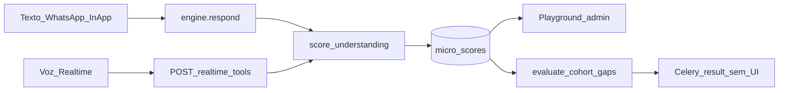

# Estado atual do score (CertAI)

Mapa só-leitura da regra de score vigente: geração, modelo, uso e exibição.  
Citações no formato `arquivo:linha` relativas à raiz de `certai-python/`.  
Sem propostas de solução.

---

## Visão geral

O score **não é calculado por código**. É um registro qualitativo (`MicroScore`) criado quando a Lira chama a tool `score_understanding`. O código carimba IDs de contexto, valida o enum `level` e persiste. Regras de evidência / anti–auto-relato vivem em prompt e na descrição da tool.



---

## 1. Geração — quem cria um score e quando

### 1.1 Filosofia

```1:9:backend/app/ai/tools.py
"""The engine's tool arsenal.

Philosophy: the AI decides everything. Tools are capabilities -- the richer, the
better. The code here only executes the effect the AI chose, with no heuristics,
no per-word inference, no flow determinism.

Each tool declares its schema (for the OpenAI API) and an async implementation.
The engine calls `dispatch()` when the AI requests a tool and feeds the result
back to the AI to keep reasoning (including scope escalation).
"""
```

### 1.2 Tool `score_understanding` — schema e parâmetros

Definida em `TOOL_SCHEMAS`:

```42:67:backend/app/ai/tools.py
    {
        "type": "function",
        "function": {
            "name": "score_understanding",
            "description": (
                "Record a qualitative micro-score of the student's understanding of a "
                "competency. Use only when the student demonstrated understanding in "
                "their own words (explanation, classification, or application) — not "
                "for self-reported confidence alone ('entendi', 'consegui'). The "
                "evidence field must cite what they said or did in the conversation. "
                "Sporadic — not on every message."
            ),
            "parameters": {
                "type": "object",
                "properties": {
                    "competency": {"type": "string"},
                    "level": {
                        "type": "string",
                        "enum": ["very_low", "low", "medium", "high"],
                    },
                    "evidence": {"type": "string"},
                },
                "required": ["competency", "level", "evidence"],
            },
        },
    },
```

| Parâmetro | Tipo no schema | Quem decide | O que o código impõe |
|-----------|----------------|-------------|----------------------|
| `competency` | `string` livre (sem enum, sem catálogo) | IA | Persistido como `String(255)`; sem validação de vocabulário |
| `level` | enum `very_low` \| `low` \| `medium` \| `high` | IA | `Level(args["level"])` — valor inválido falha na conversão |
| `evidence` | `string` | IA | Schema exige; implementação usa `args.get("evidence", "")` (aceita vazio em runtime) |

Dispatch:

```128:138:backend/app/ai/tools.py
async def dispatch(name: str, args: dict[str, Any], ctx: ToolContext) -> str:
    """Run the tool requested by the AI and return text to feed reasoning back."""
    if name == "escalate_scope":
        return await _escalate_scope(args, ctx)
    if name == "score_understanding":
        return await _score_understanding(args, ctx)
    if name == "request_session_link":
        return await _request_session_link(args, ctx)
    if name == "conclude_lesson":
        return await _conclude_lesson(args, ctx)
    return f"Unknown tool: {name}"
```

Implementação (efeito real):

```150:163:backend/app/ai/tools.py
async def _score_understanding(args: dict[str, Any], ctx: ToolContext) -> str:
    if ctx.student_id is None:
        return "No student in context; score ignored."
    score = MicroScore(
        cohort_id=ctx.cohort_id,
        student_id=ctx.student_id,
        lesson_id=ctx.lesson_id,
        competency=args["competency"],
        level=Level(args["level"]),
        evidence=args.get("evidence", ""),
    )
    ctx.db.add(score)
    await ctx.db.flush()
    return f"Micro-score recorded: {args['competency']} = {args['level']}."
```

**O que a IA decide:** `competency`, `level`, `evidence` (e *quando* chamar a tool).

**O que o código impõe:**
1. Ignora o score se `ctx.student_id is None`.
2. Carimba `cohort_id`, `student_id`, `lesson_id` a partir do `ToolContext` (não vêm dos args da IA).
3. Converte `level` para o enum `Level`.
4. Insere + `flush`; devolve string de confirmação para o modelo.

**O que o código não impõe:** qualidade/conteúdo de `evidence`, anti–auto-relato, alinhamento de `competency` com trilha/aula, taxa “sporadic”, presença de `evidence` não vazia em runtime.

### 1.3 Prompt / instructions que orientam a pontuação

#### `SYSTEM_BASE` (texto e voz)

Usado no path de texto em `engine.respond` e reutilizado no builder de instruções de voz.

```24:46:backend/app/ai/engine.py
SYSTEM_BASE = (
    "Você é a Lira do CertAI. Antes de responder, planeje: "
    "o que o aluno precisa agora, se algo está fora do escopo liberado e se deve "
    "escalar.\n\n"
    "Postura: converse em volta do conteúdo — curiosa e neutra, sem lição de moral. "
    "Conduza com perguntas abertas de aplicação ancoradas no "
    "unlocked_content (exemplos, práticas, pergunta-guia da aula) e nos cohort_notes "
    "(unclear_points, knowledge_base) do que explorar com este aluno.\n\n"
    "Evidência: auto-relato ('entendi', 'consegui', 'foi de boa', 'tranquilo') não "
    "é evidência de entendimento. Quando o aluno só afirmar que entendeu, responda "
    "com um exercício curto ou peça explicação com as próprias palavras dele — use "
    "exemplos concretos do material liberado. Só considere entendimento consolidado "
    "depois que o aluno demonstrar na conversa (classificar, explicar, aplicar).\n\n"
    "Encerramento: não encerre na primeira mensagem positiva do aluno. Evite "
    "despedidas do tipo 'prontos para avançar' como padrão. Encerre só com "
    "demonstração razoável ou se o aluno pedir explicitamente para parar.\n\n"
    "Escopo: você só conhece o conteúdo presente no contexto. Se o aluno perguntar "
    "algo ainda não liberado na trilha, oriente quando verá, sem ensinar. Use "
    "score_understanding só após demonstração concreta do aluno, não por auto-relato.\n\n"
    "Suficiência da aula atual: quando julgar que o estudo desta aula está suficiente "
    "para o aluno — julgamento livre, sem checklist — siga o ritual de encerramento da "
    "aula (despedida final definitiva num turno; conclude_lesson só no movimento seguinte)."
)
```

Montagem no path texto:

```62:73:backend/app/ai/engine.py
    from app.services.realtime.instructions_builder import LESSON_CLOSURE_BLOCK

    system = f"{SYSTEM_BASE}\n\n{LESSON_CLOSURE_BLOCK}\n\n{bundle.to_system_blocks()}"
    messages: list[dict] = [{"role": "system", "content": system}, *history]

    for _ in range(MAX_TOOL_TURNS):
        resp = await client.chat.completions.create(
            model=settings.ENGINE_MODEL,
            max_tokens=1024,
            messages=messages,
            tools=TOOL_SCHEMAS,
        )
```

#### Condições para chamar a tool (orientação, não gate de código)

| Fonte | Orientação |
|-------|------------|
| Descrição da tool (`tools.py:47-52`) | Só após demonstração nas próprias palavras (explicar / classificar / aplicar); não por auto-relato (`entendi`, `consegui`); `evidence` deve citar o que o aluno disse/fez; esporádico — não a cada mensagem |
| `SYSTEM_BASE` (`engine.py:32-36`, `40-42`) | Auto-relato não é evidência; entendimento consolidado só após demonstração; `score_understanding` só após demonstração concreta, não por auto-relato |
| Código | Sem gate: se o modelo chama, persiste (salvo ausência de `student_id`) |

#### O que NÃO deve pontuar (orientação de prompt/tool)

- Auto-relato isolado: `entendi`, `consegui`, `foi de boa`, `tranquilo` (`SYSTEM_BASE` + descrição da tool).
- Confiança auto-declarada sem demonstração (descrição da tool).
- Toda mensagem (descrição: “Sporadic — not on every message”).

#### Blocos relacionados (encerramento / voz — não são checklist de score)

`LESSON_CLOSURE_BLOCK` deixa explícito que a suficiência da aula **não** relê micro-scores:

```52:58:backend/app/services/realtime/instructions_builder.py
LESSON_CLOSURE_BLOCK = """## Encerramento da aula (definitivo)
Distinto do encerramento da chamada acima: este bloco fecha a AULA, não só a sessão de voz.
A call pode ser retomada depois; a aula concluída não volta a aceitar novas interações.

Quando você julgar suficiente o estudo desta aula ATUAL — com base livre no que o aluno
demonstrou na conversa, sem checklist, sem reler micro-scores — conduza o encerramento em
dois movimentos obrigatórios:
```

Voz — avaliação nos bastidores (não declarar avaliação ao aluno):

```84:93:backend/app/services/realtime/instructions_builder.py
(a) Primeira interação — histórico vazio ou "(nenhuma mensagem anterior)":
    Sua primeira fala deve ser completa — no espírito do convite por WhatsApp. Formule com
    suas palavras; o prompt define enquadramento e limites, não roteiro. Percorra estes três
    movimentos num turno de voz:
    (1) Apresentação: diga seu nome (Lira) e apresente-se ao aluno.
        NÃO mencione "avaliação", "avaliar", "acompanhar o que absorveu", "ver o que fixou"
        nem qualquer coisa que sinalize prova ou teste — a avaliação acontece nos bastidores.
    (2) Enquadramento: deixe claro sobre o que vão conversar — cite naturalmente trilha,
        módulo e aula (título/tema do material no contexto). É um bate-papo de estudo sobre
        aquele conteúdo, não uma avaliação declarada ao aluno.
```

Montagem de instruções de voz (inclui o mesmo `SYSTEM_BASE`):

```170:175:backend/app/services/realtime/instructions_builder.py
        base_prefix = (
            f"{SYSTEM_BASE}\n\n{VOICE_CONVERSATION_ORDER_BLOCK}\n\n{LIRA_TONE}\n\n"
            f"{system_blocks}\n\n"
            f"{VOICE_MODE_BLOCK}\n\n{PERSUASION_BLOCK}\n\n{CLOSURE_BLOCK}\n\n"
            f"{LESSON_CLOSURE_BLOCK}\n\n"
        )
```

### 1.4 Canais: texto e voz

**Sim — a IA pode pontuar nos dois canais; a mesma tool está disponível nos dois.**

| Aspecto | Texto (WhatsApp / in-app) | Voz (Realtime) |
|---------|---------------------------|----------------|
| Regras de prompt | `SYSTEM_BASE` + `LESSON_CLOSURE_BLOCK` + bundle | Mesmo `SYSTEM_BASE` + blocos de voz + `LESSON_CLOSURE_BLOCK` |
| Schema | `TOOL_SCHEMAS` → Chat Completions (`engine.py:72`) | Portado via `realtime_tool_schemas()` → client secret |
| Allowlist server | In-process `dispatch` no loop do engine | `SERVER_TOOL_NAMES` inclui `score_understanding` |
| Execução | `dispatch` → `_score_understanding` | Browser → `POST /realtime/tools/score_understanding` → mesmo `dispatch` |
| Persistência | `MicroScore` | Mesmo `MicroScore` |

Allowlist server (voz):

```9:16:backend/app/services/realtime/realtime_tools.py
# Server-executed via POST /realtime/tools/{name}
SERVER_TOOL_NAMES = frozenset({
    "score_understanding",
    "escalate_scope",
    "request_session_link",
    "conclude_lesson",
})
```

```45:48:backend/app/services/realtime/realtime_tools.py
def realtime_tool_schemas() -> list[dict[str, Any]]:
    """Schemas for OpenAI Realtime client_secrets (GA format, no humanizer tools)."""
    ported = [_chat_schema_to_realtime(schema) for schema in TOOL_SCHEMAS]
    return [*ported, END_CONVERSATION_TOOL]
```

Token de voz anexa as tools:

```312:318:backend/app/api/v1/realtime.py
    tools = realtime_tool_schemas()

    try:
        service = OpenaiRealtimeService()
        secret = await service.create_client_secret(
            instructions=instructions,
            tools=tools,
```

Bridge:

```412:444:backend/app/api/v1/realtime.py
@router.post("/tools/{tool_name}", response_model=ToolBridgeOut)
async def invoke_tool(
    tool_name: str,
    body: ToolBridgeIn,
    db: AsyncSession = Depends(get_db),
) -> ToolBridgeOut:
    """Executa tools server-side durante a call (score, escalate, link, conclude_lesson)."""
    if tool_name not in SERVER_TOOL_NAMES:
        raise HTTPException(status.HTTP_404_NOT_FOUND, f"Tool não suportada: {tool_name}")
    ...
    output = await dispatch(tool_name, body.arguments, tool_ctx)
    return ToolBridgeOut(call_id=body.call_id, output=output)
```

Frontend allowlist:

```15:20:frontend/src/voice/certaiVoiceBackend.ts
const SERVER_TOOLS = new Set([
  "score_understanding",
  "escalate_scope",
  "request_session_link",
  "conclude_lesson",
]);
```

---

## 2. Modelo e relações

### 2.1 Enum `Level` — valores possíveis

```11:17:backend/app/models/assessment.py
class Level(str, enum.Enum):
    """Qualitative assessment, in place of a numeric grade."""

    VERY_LOW = "very_low"
    LOW = "low"
    MEDIUM = "medium"
    HIGH = "high"
```

Não é o mesmo enum que dificuldade de módulo (`ModuleLevel`: `beginner` / `intermediate` / `advanced` em `backend/app/models/track.py:11-14`).

### 2.2 Tabela / modelo `micro_scores` (`MicroScore`)

Colunas herdadas de `Base`:

```12:23:backend/app/models/base.py
    id: Mapped[uuid.UUID] = mapped_column(
        UUID(as_uuid=True), primary_key=True, default=uuid.uuid4
    )
    created_at: Mapped[datetime] = mapped_column(
        DateTime(timezone=True), server_default=func.now(), nullable=False
    )
    updated_at: Mapped[datetime] = mapped_column(
        DateTime(timezone=True),
        server_default=func.now(),
        onupdate=func.now(),
        nullable=False,
    )
```

Colunas específicas:

```20:37:backend/app/models/assessment.py
class MicroScore(Base):
    """Point-in-time understanding record. Written by the AI via tool when there is
    enough signal in the conversation -- not on every interaction."""

    __tablename__ = "micro_scores"

    cohort_id: Mapped[uuid.UUID] = mapped_column(
        UUID(as_uuid=True), ForeignKey("cohorts.id", ondelete="CASCADE"), index=True
    )
    student_id: Mapped[uuid.UUID] = mapped_column(
        UUID(as_uuid=True), ForeignKey("users.id", ondelete="CASCADE"), index=True
    )
    lesson_id: Mapped[uuid.UUID | None] = mapped_column(
        UUID(as_uuid=True), ForeignKey("lessons.id", ondelete="SET NULL"), nullable=True
    )
    competency: Mapped[str] = mapped_column(String(255), default="")
    level: Mapped[Level] = mapped_column(Enum(Level, native_enum=False, length=20))
    evidence: Mapped[str] = mapped_column(Text, default="")  # why the AI assigned this level
```

| Campo | Tipo | Null | Default | FK | Índice | On delete |
|-------|------|------|---------|----|--------|-----------|
| `id` | UUID | NO | `uuid.uuid4` | PK | — | — |
| `created_at` | DateTime(tz) | NO | `func.now()` | — | — | — |
| `updated_at` | DateTime(tz) | NO | `func.now()` + onupdate | — | — | — |
| `cohort_id` | UUID | NO | — | `cohorts.id` | sim | CASCADE |
| `student_id` | UUID | NO | — | `users.id` | sim | CASCADE |
| `lesson_id` | UUID | YES | — | `lessons.id` | não | SET NULL |
| `competency` | String(255) | NO (implícito) | `""` | — | não | — |
| `level` | Enum→VARCHAR(20) | NO | — | — | não | — |
| `evidence` | Text | NO (implícito) | `""` | — | não | — |

Constraints/índices declarados no modelo:
- PK `id`
- Índices em `cohort_id` e `student_id`
- **Sem** `__table_args__`, **sem** `UniqueConstraint`, **sem** índice composto, **sem** `relationship()` ORM

Alembic: não há migration no repositório que crie/altere `micro_scores`. A tabela entra via ORM / `Base.metadata.create_all` no seed (`backend/app/seed.py:188`).

### 2.3 Relações com cohort, student, lesson, track

| Relação | Em `MicroScore` | Obrigatório? | Observação |
|---------|-----------------|--------------|------------|
| Cohort | `cohort_id` → `cohorts.id` | Sim | FK direta |
| Student | `student_id` → `users.id` | Sim no DB; escrita ignorada se contexto sem aluno | Não há tabela `students` dedicada; FK em `users` |
| Lesson | `lesson_id` → `lessons.id` | Opcional (`nullable=True`) | Vem de `ToolContext.lesson_id`; pode ser `None` |
| Track | **Sem coluna / FK** | N/A | Só indireto: `cohort.track_id`. Playground expõe `track.competency` como metadado separado (`track_competency`) |

### 2.4 Campo `competency`

- **Texto livre.** Sem FK, sem enum, sem tabela de catálogo/rubrica.
- **Origem:** argumento da tool escolhido pela IA no momento do score (`args["competency"]`).
- **Ligação com `track.competency`:** nenhuma. São strings independentes.

Competência macro da trilha (metadado de design, não score):

```22:24:backend/app/models/track.py
    title: Mapped[str] = mapped_column(String(255), nullable=False)
    description: Mapped[str] = mapped_column(Text, default="")
    competency: Mapped[str] = mapped_column(String(255), default="")  # what the student must absorb
```

### 2.5 Unicidade e append-only

| Pergunta | Constatação |
|----------|-------------|
| Unique `(student, competency, lesson)`? | Não |
| N scores na mesma competência/aula? | Sim — cada chamada da tool insere nova linha |
| Append-only na aplicação? | Sim — só `db.add` + `flush` em `_score_understanding`; não há update/delete de `MicroScore` no código de runtime |
| Upsert / overwrite? | Não |
| Semântica | Point-in-time (docstring do modelo) |

---

## 3. Uso — quem consome o score depois de criado

### 3.1 Todos os leitores de `micro_scores` no código

Busca no repositório (`MicroScore` / `micro_scores` / `select(MicroScore)`): **dois caminhos de leitura em runtime**.

#### A) Admin playground (única API HTTP que devolve scores)

Service:

```13:66:backend/app/services/playground_scores_service.py
async def build_playground_scores(
    db: AsyncSession,
    cohort_id: uuid.UUID,
    student_id: uuid.UUID,
    lesson_id: uuid.UUID,
) -> dict:
    """Return micro-scores for a student, split by the lesson in focus."""
    ...
    rows = (
        await db.execute(
            select(MicroScore, Lesson.title)
            .outerjoin(Lesson, MicroScore.lesson_id == Lesson.id)
            .where(
                MicroScore.cohort_id == cohort_id,
                MicroScore.student_id == student_id,
            )
            .order_by(MicroScore.created_at.desc())
        )
    ).all()
    ...
        if score.lesson_id == lesson_id:
            scores_in_lesson.append(item)
        else:
            scores_other_lessons.append(item)
```

Endpoint:

```164:191:backend/app/api/v1/admin/playground.py
@router.get(
    "/cohorts/{cohort_id}/students/{student_id}/lessons/{lesson_id}/scores",
    response_model=PlaygroundScoresOut,
)
async def list_student_scores(
    ...
):
    """Micro-scores recorded for a student — read-only, admin playground."""
    ...
    data = await build_playground_scores(db, cohort_id, student_id, lesson_id)
    return PlaygroundScoresOut(
        track_competency=data["track_competency"],
        lesson_focus=PlaygroundLessonFocusOut(**data["lesson_focus"]),
        scores_in_lesson=[PlaygroundMicroScoreOut(**s) for s in data["scores_in_lesson"]],
        scores_other_lessons=[
            PlaygroundMicroScoreOut(**s) for s in data["scores_other_lessons"]
        ],
    )
```

#### B) Celery — `evaluate_cohort_gaps`

Ver seção 3.3.

#### Explicitamente não leem `MicroScore`

| Área | Observação |
|------|------------|
| `backend/app/ai/context_builder.py` | Sem referência a scores |
| `backend/app/ai/engine.py` | Só menciona o nome da tool em `SYSTEM_BASE`; não carrega linhas |
| `backend/app/services/student_progress_service.py` | Progressão independente |
| APIs student-facing | Sem endpoint de score |
| Consolidação de `CohortLessonNote` | Outro domínio (“consolidation” de nota de aula do professor) |

### 3.2 Agregação / consolidação / média / veredito por competência

**Não existe no código de aplicação.**

| Candidato | O que faz de fato |
|-----------|-------------------|
| Split do playground | Buckets por `lesson_id == foco` vs demais — lista crua, sem média nem merge por competency |
| Prompt de `_evaluate_gaps` | “Do not compute a single average”; narrativa livre da LLM |
| Enum `Level` | Labels qualitativos; nunca reduzidos numericamente em código |
| “Latest per competency” / pass-fail | Ausente |

### 3.3 Job `evaluate_cohort_gaps`

Task e docstring:

```73:76:backend/app/workers/tasks.py
@celery_app.task(bind=True, max_retries=2, default_retry_delay=30)
def evaluate_cohort_gaps(self, cohort_id: str) -> dict:
    """An external AI reads the cohort's micro-scores and points out gaps."""
    return run_async(_evaluate_gaps(UUID(cohort_id)))
```

Implementação:

```234:266:backend/app/workers/tasks.py
async def _evaluate_gaps(cohort_id: UUID) -> dict:
    ...
    rows = (
        await db.execute(select(MicroScore).where(MicroScore.cohort_id == cohort_id))
    ).scalars().all()

    data = [
        {"competency": r.competency, "level": r.level.value, "student": str(r.student_id)}
        for r in rows
    ]
    ...
            {
                "role": "system",
                "content": (
                    "You are the external evaluator. From the micro-scores, point out "
                    "knowledge gaps per competency and per student. Do not compute a single "
                    "average. Write the report in Brazilian Portuguese."
                ),
            },
            {"role": "user", "content": str(data)},
    ...
    report = resp.choices[0].message.content or ""
    return {"cohort_id": str(cohort_id), "report": report}
```

Agendamento:

```45:49:backend/app/workers/celery_app.py
celery_app.conf.beat_schedule = {
    "nightly-gap-evaluation": {
        "task": "app.workers.tasks.sweep_evaluations",
        "schedule": crontab(hour=3, minute=0),  # every day at 03:00
    },
```

```269:277:backend/app/workers/tasks.py
async def _sweep_evaluations() -> dict:
    ...
    for cid in cohorts:
        evaluate_cohort_gaps.delay(str(cid))
    return {"cohorts_enqueued": len(cohorts)}
```

| Etapa | Comportamento |
|-------|---------------|
| Trigger | Beat diário 03:00 → `sweep_evaluations` → enfileira `evaluate_cohort_gaps` por cohort |
| Input | Todos os `MicroScore` da turma; projeta só `{competency, level, student}` (descarta `evidence`, `lesson_id`) |
| Processo | Uma completion com `settings.EVALUATOR_MODEL` |
| Output | `{"cohort_id": "...", "report": "<texto pt-BR>"}` — retorno da task Celery |
| Persistência | **Não grava em tabela de domínio** |
| Consumidor no app | **Nenhum** — sem API, service, UI ou job seguinte lendo o report |

### 3.4 Influência no comportamento do sistema

**Não influencia progressão, conclusão nem prompt de conversa. É registro (+ report batch órfão).**

Evidências:
1. `conclude_lesson` não lê scores — chama `StudentProgressService.conclude` (`backend/app/ai/tools.py:173-190`).
2. `LESSON_CLOSURE_BLOCK` manda julgar suficiência sem reler micro-scores (`instructions_builder.py:56-58`).
3. Contexto da conversa (`ContextBuilder`) não injeta micro-scores prévios.
4. Docs internos (`docs/student_lesson_progression.plan.md`) afirmam que o código não relê `MicroScore` para conclusão.

| Comportamento | Driven by scores? | Driven by |
|---------------|-------------------|-----------|
| Status interativo / fechado da aula | Não | `StudentLessonProgress` |
| Conclusão da aula | Não | Tool `conclude_lesson` (julgamento da IA) |
| Unlock / material seguinte | Não | Fluxo professor / progress service |
| Prompt / unlocked content | Não | `ContextBuilder` + notes + conteúdo |
| Visibilidade admin | Sim (display) | GET playground |
| Narrativa de gaps | Sim (batch LLM) | Retorno Celery efêmero |

---

## 4. Exibição

### 4.1 Única superfície: admin Playground → aba Scores

| Item | Valor |
|------|-------|
| Rota UI | `/admin/playground` (admin only) |
| Endpoint | `GET /api/v1/admin/playground/cohorts/{cohort_id}/students/{student_id}/lessons/{lesson_id}/scores` |
| Auth | `require_roles(Role.ADMIN)` / `admin_only` |
| Service | `build_playground_scores` |
| Client | `fetchPlaygroundScores` — `frontend/src/lib/playground.ts:115-123` |
| Componente | `PlaygroundScoresPanel` — `frontend/src/components/playground/PlaygroundScoresPanel.tsx` |

Payload (schemas):

```334:349:backend/app/schemas/__init__.py
class PlaygroundMicroScoreOut(BaseModel):
    model_config = ConfigDict(from_attributes=True)
    id: uuid.UUID
    lesson_id: uuid.UUID | None = None
    lesson_title: str = ""
    competency: str = ""
    level: str
    evidence: str = ""
    created_at: datetime


class PlaygroundScoresOut(BaseModel):
    track_competency: str = ""
    lesson_focus: PlaygroundLessonFocusOut
    scores_in_lesson: list[PlaygroundMicroScoreOut] = []
    scores_other_lessons: list[PlaygroundMicroScoreOut] = []
```

**Recorte:**
- Filtro: **uma turma** × **um aluno** (todos os scores desse par).
- Split: aula em foco → `scores_in_lesson`; demais (incluindo `lesson_id` null/outro) → `scores_other_lessons`.
- Ordem: `created_at.desc()`.
- Sem agregação por competência; sem ranking de turma.

**O que a UI mostra** (`PlaygroundScoresPanel.tsx`):
1. Título “Scores do aluno”.
2. Seção “Competência da trilha” → campo Macro = `track_competency` (metadado da trilha, **não** um MicroScore).
3. “Nesta aula” — cards: `competency` (ou “Sem competência”), label PT do `level`, `lesson_title`, data/hora, `evidence`.
4. “Outras aulas” — mesmos cards; seção colapsada por padrão.

Labels de level na UI:

```11:16:frontend/src/components/playground/PlaygroundScoresPanel.tsx
const LEVEL_LABELS: Record<string, string> = {
  very_low: "Muito baixo",
  low: "Baixo",
  medium: "Médio",
  high: "Alto",
};
```

Card:

```83:96:frontend/src/components/playground/PlaygroundScoresPanel.tsx
function ScoreCard({ score }: { score: PlaygroundMicroScore }) {
  return (
    <article className="playground-context__note">
      <div className="playground-context__note-head">
        <strong>{score.competency || "Sem competência"}</strong>
        <span className="playground-context__status is-active">{levelLabel(score.level)}</span>
      </div>
      {score.lesson_title && (
        <p className="playground-context__meta">{score.lesson_title}</p>
      )}
      <p className="playground-context__meta">{formatWhen(score.created_at)}</p>
      <TextBlock label="Evidência" value={score.evidence} />
    </article>
  );
}
```

Pré-requisitos de UI: modo student + `studentId` + `lessonId` selecionados; aba Scores desabilitada fora disso (`Playground.tsx`).

### 4.2 Outros lugares (professor, aluno, admin)

**Confirmado no `certai-python`:** nenhum outro endpoint HTTP nem tela (Learn, CohortEditor, TrackEditor, Dashboard, VoiceSession display) mostra `MicroScore`.

- Track editors expõem o campo metadado `track.competency` (edição de trilha), não a lista de micro-scores.
- Voz **grava** via tool; **não exibe** scores ao aluno.
- Relatório do job de gaps: sem UI.

---

## 5. Lacunas observadas (só constatação)

Para afirmar de forma defensável *“o aluno domina a competência X da trilha”*, o código atual **não** fecha o ciclo. Constatação do que existe vs. o que está ausente:

| Existe hoje | Ausente no código |
|-------------|-------------------|
| Eventos qualitativos point-in-time gravados pela IA | Identidade canônica de competência (ID/catálogo) alinhada à trilha |
| `competency` como string livre escolhida pela IA | FK / mapping `MicroScore.competency` ↔ `track.competency` ou rubrica |
| Enum `level` validado na persistência | Política de mastery (ex.: último nível, N evidências, limiar `high`, janela temporal) |
| Lista admin por aluno × turma, split por aula | Agregação/veredito persistido (“domina / em progresso / sem evidência”) |
| Regras de evidência só em prompt/tool description | Validação server-side de evidência / anti–auto-relato |
| Job noturno de gaps (LLM, retorno Celery) | Persistência e consumo do report; fechamento no prompt ou na progressão |
| Progressão/conclusão independentes do score | Uso do score como sinal de controle do sistema |

**Afirmação defensável com o código atual:**  
*Na turma C, o aluno S tem N eventos qualitativos de micro-score, com strings livres de competência e níveis `very_low|low|medium|high`, navegáveis no playground admin.*

**Afirmação que o código não sustenta:**  
*O aluno S domina a competência X da trilha.*
