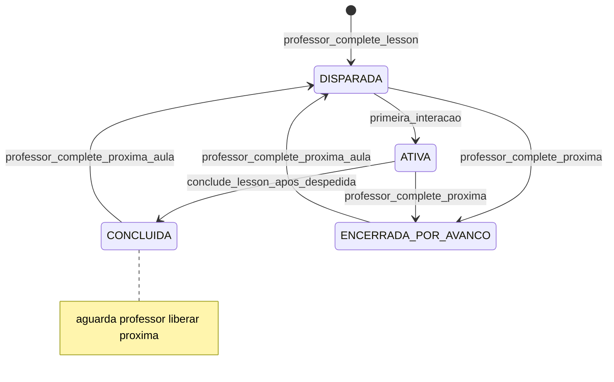
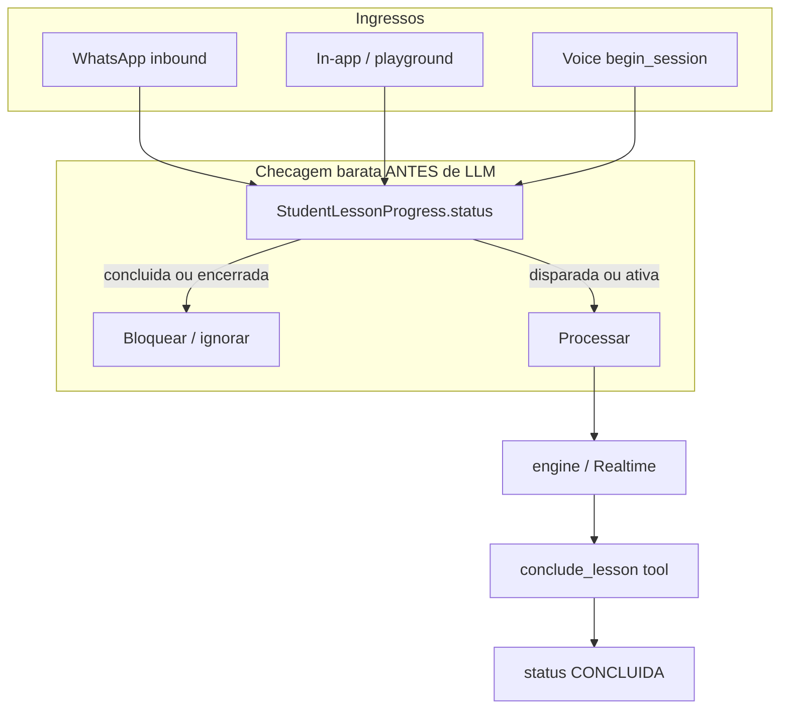
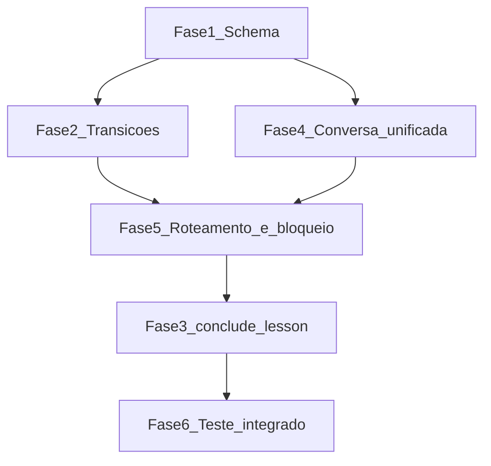

# Plano: Núcleo de Progressão do Aluno na Aula

**Projeto:** `certai-python` · branch `feat-realtime-v2`  
**Referências:** [`mapa-background-lira.md`](../mapa-background-lira.md), [`realtime_voice_channel_6e560811.plan.md`](realtime_voice_channel_6e560811.plan.md)  
**Princípio inegociável:** inteligência decide, código registra o efeito; mínimo de estrutura; sem heurística; sem migração de dados (assumir `bin/db-reset`).

**Regra de execução:** implementar **todas as fases hoje** na ordem **1 → 2 → 4 → 5 → 3 → 6**. Testar fluxos existentes + novos ao final (Fase 6).

---

## Fase 0 — Achados (validação contra código)

### F0.1 — Progressão hoje é só por turma

| Conceito | Onde | Comportamento |
|---|---|---|
| Desbloqueio de contexto | `backend/app/models/cohort.py` (`CohortProgress`) | Linha criada em `complete_lesson()` — existência = aula liberada no bundle |
| Aula "atual" da turma | `backend/app/api/v1/cohorts.py` (`_current_lesson_id`) | Primeira aula ativa da trilha **sem** row em `CohortProgress` |
| Convite ao aluno | `backend/app/services/whatsapp/dispatch_service.py` | Celery após ingestão `done`; cria `Conversation(WHATSAPP)` + template |

**Lacuna confirmada:** não existe `StudentLessonProgress` nem equivalente. Não há estado DISPARADA/ATIVA/CONCLUIDA por aluno.

**Encaixe de DISPARADA:** criar `DISPARADA` para **todos os matriculados** no `complete_lesson()` (cohort desbloqueou). WhatsApp dispatch é efeito colateral de convite, não pré-requisito do status.

### F0.2 — `complete_lesson` e avanço do professor

Fluxo em `backend/app/services/lesson_completion_service.py`:

1. `CohortLessonNote` (ingestão pendente)
2. `CohortProgress` se ausente (unlock imediato)
3. `enqueue_after_commit → ingest_lesson_completion → plan_dispatch`

**Único gatilho para próxima aula do aluno:** professor dispara via `complete_lesson`. A tool `conclude_lesson` **não** cria progresso da aula seguinte — aluno em `CONCLUIDA` aguarda o professor liberar material/contexto da próxima.

**Plugs:**
- `ENCERRADA_POR_AVANCO`: ao liberar aula N, encerrar `DISPARADA`/`ATIVA` da aula anterior (N-1)
- `DISPARADA` (aula N): para cada `Enrollment` após criar `CohortProgress` da aula N

### F0.3 — Motor de score (referência para `conclude_lesson`)

Padrão em `backend/app/ai/tools.py` — **copiar sem desvio**:

| Peça | Onde |
|---|---|
| Schema | `TOOL_SCHEMAS` |
| Efeito | `_conclude_lesson` chamado por `dispatch()` |
| Texto | loop em `backend/app/ai/engine.py` |
| Voz | `SERVER_TOOL_NAMES` em `realtime_tools.py` → `POST /realtime/tools/{name}` |
| Cliente | whitelist em `frontend/src/voice/certaiVoiceBackend.ts` |
| Contexto | `ToolContext` (mesmos campos das demais tools) |

**Suficiência:** julgamento 100% da IA via tool call — código não relê `MicroScore`, não valida checklist, não cria próxima aula.

### F0.4 — Conversa hoje vs. modelo alvo

**O que NÃO estamos removendo:** a capacidade de falar por múltiplos canais (WhatsApp, voz, in-app/playground) nem a identificação da origem. Cada mensagem continua registrando seu canal via `Message.source` (`whatsapp_text`, `whatsapp_audio`, `realtime_voice`, `in_app_text`) — campo que **já existe** e permanece.

**O que estamos mudando:** hoje `Conversation.channel` faz a conversa ser **por canal** — até 3 rows por `(cohort, aluno, aula)`. O modelo alvo é **uma `Conversation` por aula**; o canal deixa de viver na conversa e passa a ser atributo da mensagem (`source`).

| Aspecto | Hoje | Alvo |
|---|---|---|
| Chave de conversa | `(cohort_id, user_id, lesson_id, channel)` | `(cohort_id, user_id, lesson_id)` + `UNIQUE` |
| Origem do turno | `Message.source` | `Message.source` (inalterado) |
| Histórico IA | `merged_lesson_history` junta N conversas | histórico de 1 conversa (sources misturados) |
| `ToolContext.channel` | lido de `Conversation.channel` | informado pelo **ponto de entrada** |

**Call sites a atualizar:** `conversation_service`, `dispatch_service`, `voice_session_service`, `voice_link_service`, `instructions_builder`, `playground.py`, `tasks.py`.

### F0.5 — Roteamento inbound (bug confirmado)

`backend/app/services/whatsapp/inbound_service.py` usa `_latest_whatsapp_conversation` com `ORDER BY updated_at DESC` — não lesson-scoped. `record_message()` não atualiza `updated_at` da conversa.

**Correção:** resolver aula via `StudentProgressService` → `get_or_create_conversation(cohort, student, lesson_id)`.

### F0.6 — Sessão ≠ aula (manter)

`VoiceSessionService.end_session()` e `end_conversation` (client-only) encerram **call**, não alteram progresso da aula.

### F0.7 — CLOSURE_BLOCK existente (referência para ritual de aula)

`instructions_builder.py` define `CLOSURE_BLOCK` — encerra **sessão de voz** (retomável via `RESUMPTION_BLOCK`). O ritual de encerramento de **aula** é distinto: definitivo, dispara `conclude_lesson`, status `CONCLUIDA`.

### F0.8 — Testes

Sem suite pytest no repo. Verificação via playground/admin, scripts (`scripts/verify_dispatch_voice_invite.py`) e teste E2E de voz obrigatório na Fase 4.

---

## Decisões de produto (fechadas)

### Status `StudentLessonProgress`

| Status | Origem |
|---|---|
| `DISPARADA` | Professor `complete_lesson` — aluno matriculado, ainda não interagiu |
| `ATIVA` | Primeira interação do aluno (qualquer canal) |
| `CONCLUIDA` | IA chama `conclude_lesson` após ritual de despedida |
| `ENCERRADA_POR_AVANCO` | Professor `complete_lesson` na próxima aula antes da IA concluir |

### Uma aula ativa por vez

Garantida na **lógica** de `StudentProgressService` (único lugar que muta status) — **não** via constraint partial-unique no banco. Ao ativar aula N, o serviço encerra/desativa coerentemente qualquer outra `ATIVA` do mesmo aluno na turma (transição explícita ou rejeição, conforme implementação mínima no serviço).

### Integridade no banco

- `UNIQUE(cohort_id, student_id, lesson_id)` em `student_lesson_progress`
- `UNIQUE(cohort_id, user_id, lesson_id)` em `conversations`
- Sem `uq_one_ativa_per_student` — regra de negócio fica no serviço

---

## Diagrama alvo

---

## Fase 1 — Schema e modelos

**Arquivos:**
- `backend/app/models/student_progress.py` (novo)
- `backend/app/models/conversation.py` — remover coluna `channel`; `UniqueConstraint("cohort_id", "user_id", "lesson_id")`
- `backend/alembic/versions/010_student_lesson_progress.py` (novo)
- `backend/app/schemas/` — schemas de saída

**Modelo `StudentLessonProgress`:**

| Campo | Tipo | Notas |
|---|---|---|
| `cohort_id`, `student_id`, `lesson_id` | UUID FK | `UNIQUE(cohort_id, student_id, lesson_id)` |
| `status` | enum | `disparada`, `ativa`, `concluida`, `encerrada_por_avanco` |
| `disparada_at` | timestamptz | criação |
| `activated_at` | timestamptz nullable | 1ª interação |
| `concluded_at` | timestamptz nullable | `conclude_lesson` |
| `encerrada_por_avanco_at` | timestamptz nullable | avanço do professor |

**Conversa unificada (migration):**
- Drop `conversations.channel`
- Add `UNIQUE(cohort_id, user_id, lesson_id)`
- Manter `messages.source` intacto

**Pronto quando:** `bin/db-reset` sobe schema limpo; models importam; constraints de unicidade existem.

**Riscos:** nenhum de migração de dados — reset limpo.

---

## Fase 2 — Serviço de transições + eventos

**Arquivos:**
- `backend/app/services/student_progress_service.py` (novo) — **único lugar que muta `status`**
- `backend/app/services/lesson_completion_service.py`
- `backend/app/services/conversation_service.py`
- `backend/app/services/realtime/voice_session_service.py`
- `backend/app/services/whatsapp/inbound_service.py`

**Transições (serviço centralizado):**

| Evento | Efeito |
|---|---|
| Professor `complete_lesson` (aula N) | `DISPARADA` (N) para matriculados; `ENCERRADA_POR_AVANCO` em N-1 se `DISPARADA`/`ATIVA` |
| 1ª mensagem/turno do aluno | `DISPARADA` → `ATIVA`; garantir uma `ATIVA` por aluno (lógica) |
| Fechar call/sessão | nenhuma mudança de status da aula |

**Helpers do serviço:**
- `resolve_routable_lesson(student_id, cohort_id)` — ATIVA, senão DISPARADA mais recente
- `is_lesson_interactive(status)` — `True` só para `disparada`/`ativa`
- `activate_on_first_interaction(...)`
- `conclude(...)` — chamado pela tool
- `close_by_advance(...)`

**Pronto quando:** `complete-lesson` → `DISPARADA`; primeira msg → `ATIVA`; segundo `complete-lesson` → anterior `ENCERRADA_POR_AVANCO`; tentativa de 2ª `ATIVA` tratada pelo serviço (não pelo banco).

---

## Fase 4 — Conversa unificada (uma por aula)

**Arquivos:**
- `backend/app/services/conversation_service.py` — `get_or_create_conversation` sem `channel`; remover `merge_channels`; histórico único
- `backend/app/services/whatsapp/dispatch_service.py`
- `backend/app/services/realtime/voice_link_service.py`
- `backend/app/services/realtime/voice_session_service.py`
- `backend/app/services/realtime/instructions_builder.py`
- `backend/app/api/v1/admin/playground.py`
- `backend/app/workers/tasks.py`
- Remover enum `ConversationChannel` onde não restar uso; **manter** `MessageSource`

**Semântica explícita:** remover `Conversation.channel` ≠ remover canais. Toda mensagem grava `Message.source`; a IA vê histórico unificado da aula com origens misturadas.

**Teste E2E voz (obrigatório nesta fase):**
1. Professor `complete-lesson` → dispatch com handoff
2. Aluno abre `/voz/:token` → `POST /realtime/token` → WebRTC
3. Turnos persistidos com `source=realtime_voice` na conversa unificada
4. Histórico cross-channel: msg WhatsApp + turno voz na mesma `Conversation`
5. Regenerar handoff após unificação (`conversation_id` no JWT)

**Pronto quando:** uma row `Conversation` por aula; E2E voz passa; fluxo WhatsApp dispatch + reply intacto.

**Riscos:** `HandoffToken` embute `conversation_id` — validar token novo pós-unificação.

---

## Fase 5 — Roteamento inbound + bloqueio pós-conclusão

**Arquivos:**
- `backend/app/services/whatsapp/inbound_service.py`
- `backend/app/services/realtime/voice_session_service.py` (`begin_session`)
- `backend/app/services/realtime/handoff_token_service.py` (validação readonly)
- `backend/app/api/v1/conversations.py` (in-app)
- `backend/app/api/v1/realtime.py` (`create_realtime_token`)

### Roteamento

Substituir `_latest_whatsapp_conversation` por:
1. `StudentProgressService.resolve_routable_lesson(student_id)`
2. `get_or_create_conversation(cohort, student, lesson_id)`

Regra v1: prioridade `ATIVA` → senão `DISPARADA` mais recente → senão `no_active_lesson`.

### Bloqueio pós-conclusão (todos os canais, ANTES de processamento caro)

Checagem por `StudentLessonProgress.status` — barata, antecipada:

| Canal | Status terminal | Comportamento |
|---|---|---|
| WhatsApp inbound | `CONCLUIDA` ou `ENCERRADA_POR_AVANCO` | **Ignorar silenciosamente** — sem LLM, sem token, sem resposta (`detail=lesson_closed`) |
| In-app / playground | idem | HTTP 403 ou resposta vazia sem chamar engine |
| Voz (`begin_session` / validação handoff) | idem | **Bloquear** antes de abrir call (junto da checagem JWT/expiração) |

Implementar em `StudentProgressService.is_lesson_interactive()` reutilizado por todos os ingressos.

**Pronto quando:**
- Inbound em aula `CONCLUIDA` não dispara Celery/LLM
- Handoff de aula fechada retorna erro antes de token OpenAI
- Roteamento cai na aula `ATIVA`, não na errada por `updated_at`

---

## Fase 3 — Tool `conclude_lesson` + ritual de encerramento

**Arquivos (padrão idêntico a `score_understanding`):**
- `backend/app/ai/tools.py` — schema em `TOOL_SCHEMAS` + `_conclude_lesson` + branch em `dispatch()`
- `backend/app/services/realtime/realtime_tools.py` — `conclude_lesson` em `SERVER_TOOL_NAMES`
- `frontend/src/voice/certaiVoiceBackend.ts` — adicionar à whitelist `SERVER_TOOLS`
- `backend/app/ai/engine.py` — `SYSTEM_BASE`: suficiência da aula atual + ritual
- `backend/app/services/realtime/instructions_builder.py` — `LESSON_CLOSURE_BLOCK` (novo)

### Comportamento da tool (código registra, IA decide)

1. Validar progresso `ATIVA` para `(student_id, lesson_id)` do `ToolContext`
2. Transição → `CONCLUIDA` + `concluded_at` via `StudentProgressService.conclude()`
3. Retornar texto curto para a IA (ex.: `"Aula marcada como concluída para este aluno."`)
4. **Não** criar `DISPARADA` da próxima aula — próxima só nasce no `complete_lesson` do professor

**Parâmetros:** `{}` ou `reason` opcional (string livre) — sem rubrica.

### Ritual de encerramento da aula (instructions)

Não é transição silenciosa. Antes/junto da tool, a IA faz **despedida final definitiva** na conversa — comunica que o estudo desta aula terminou, se despede bem, encerra o assunto.

**Novo bloco `LESSON_CLOSURE_BLOCK`** (instructions de texto e voz):

- Inspirado em `CLOSURE_BLOCK` (`instructions_builder.py`) mas para **aula**, não sessão
- `CLOSURE_BLOCK` → fecha call (retomável, `RESUMPTION_BLOCK`)
- `LESSON_CLOSURE_BLOCK` → fecha aula (definitivo, chama `conclude_lesson` **depois** da despedida falada)
- Ordem: despedida completa em turno de conversa → movimento seguinte chama `conclude_lesson`

Incluir em `SYSTEM_BASE` (WhatsApp/in-app) e `instructions_builder` (voz).

**Pronto quando:** playground/voz executam tool; status `CONCLUIDA`; despedida visível no histórico antes da tool; próxima aula **não** aparece até professor `complete-lesson`.

---

## Fase 6 — Integridade, hardening e teste integrado

**Arquivos:**
- `backend/app/services/student_progress_service.py` — revisão final (todas mutações centralizadas)
- Script de verificação (novo ou extensão de `scripts/verify_dispatch_voice_invite.py`)

**Checklist de teste integrado (rodar ao final):**

| Fluxo | Verificação |
|---|---|
| Professor `complete-lesson` | `CohortProgress` + `DISPARADA` por aluno |
| WhatsApp dispatch + inbound | roteamento por aula ativa; histórico unificado |
| Voz E2E | handoff → call → turnos → end (regressão pós-Fase 4) |
| `conclude_lesson` | ritual + `CONCLUIDA`; sem próxima aula criada |
| Bloqueio pós-conclusão | WhatsApp ignorado; voz bloqueada; in-app rejeitado |
| Professor avança antes da IA | `ENCERRADA_POR_AVANCO` + nova `DISPARADA` |
| Unicidade | duplicata `(cohort, user, lesson)` em conversa falha no banco |
| Sessão ≠ aula | `end_session` não altera progresso |

**Pronto quando:** checklist acima passa manualmente; transições inválidas (ex.: `CONCLUIDA` → `ATIVA`) rejeitadas no serviço.

---

## Sequência e dependências

**Ordem de execução:** 1 → 2 → 4 → 5 → 3 → 6

---

## Fora de escopo

Reconvite proativo, percentuais/certificação, competências por aula, transcrição de relato, multi-aula simultânea, migração de dados legados, UI de progresso por aluno no frontend (opcional pós-MVP).
