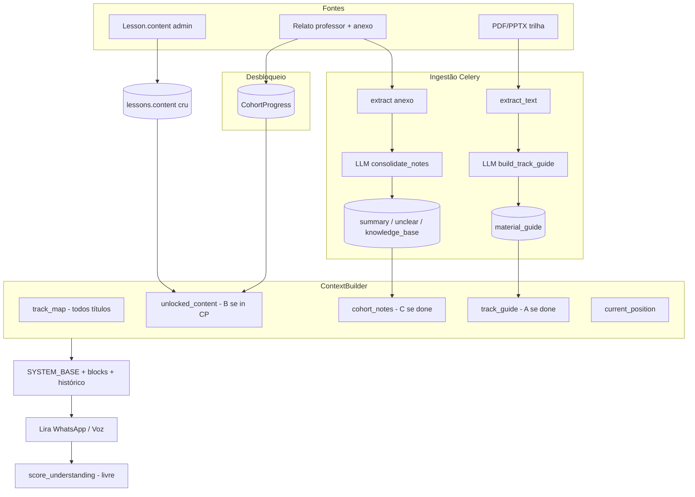

# Relatório: mapa do background da Lira (certai-python · `feat-realtime-v2`)

Investigação somente leitura. Todas as afirmações abaixo apontam para código existente.

---

## Visão geral do pipeline

```
Fontes A/B/C  →  ingestão (A e C) ou texto cru (B)  →  colunas no Postgres
                              ↓
                    ContextBuilder.build_lesson()
                              ↓
                    ContextBundle.to_system_blocks()
                              ↓
         SYSTEM_BASE + blocos  →  engine (WhatsApp/in-app) ou RealtimeInstructionsBuilder (voz)
```

Padrão explícito: **sem embeddings/RAG** — texto extraído → um passe LLM → colunas `Text` → bundle (`ingestion/__init__.py`).

---

## 1. MATERIAL DA TRILHA (A)

### Entrada e disparo

| Etapa | Onde |
|---|---|
| Upload | `POST /tracks/{track_id}/material` em `tracks.py` |
| UI | `TrackEditor.tsx` — formulário “Enviar/Substituir material” |
| Worker | Celery `ingest_track_material` → `_ingest_track_material` em `tasks.py` |
| Serviço | `track_material_service.ingest_track_material()` |

No upload:
- Arquivo salvo em storage: `tracks/{track_id}/material/{uuid}{ext}`
- Campos resetados: `material_extracted_text=""`, `material_guide=""`, `material_ingestion_status="pending"`
- Task enfileirada após commit

Reprocessamento: `POST /tracks/{track_id}/material/ingest` (`reingest_track_material`).

### Formatos aceitos vs. extraíveis

**Upload permitido** (`TRACK_MATERIAL_BY_EXT` em `upload_validation.py`):
- `.pdf`
- `.ppt` (legado)
- `.pptx`

**Extração real** (`extraction.py`):
- `.pdf` → `pypdf`
- `.pptx` → `python-pptx` (texto de shapes + tabelas + notas de slide)
- `.txt`, `.docx` também existem no extrator, mas **não** estão em `TRACK_MATERIAL_BY_EXT` para material de trilha

**`.ppt` legado:** aceito no upload, mas `extract_text()` lança `UnsupportedFormatError` → status `unsupported`, guia vazio.

### Pipeline de ingestão

```python
# track_material_service.py
async def ingest_track_material(db: AsyncSession, track_id: uuid.UUID) -> Track:
    ...
    track.material_ingestion_status = INGESTION_PROCESSING
    ...
    extracted = extract_text(content, extension)  # ou UnsupportedFormatError
    track.material_extracted_text = extracted
    track.material_guide = await build_track_guide(extracted)  # passe LLM
    track.material_ingestion_status = INGESTION_DONE
```

`build_track_guide()`:
- Modelo: `settings.ENGINE_MODEL`
- Prompt pede JSON `{"guide": "<string markdown pt-BR>"}` — guia **macro** (propósito, competências, mapa de temas, orientação conversacional)
- Instrução explícita: **não** reproduzir conteúdo aula a aula

### Persistência (`Track` model)

| Campo | Conteúdo | Entra na Lira? |
|---|---|---|
| `material_storage_key` / `material_filename` | arquivo bruto | **Não** |
| `material_extracted_text` | texto bruto extraído (até 60k chars) | **Não** |
| `material_guide` | guia macro pós-LLM | **Sim** (se `done`) |
| `material_ingestion_status` | `pending` / `processing` / `done` / `failed` / `unsupported` | gate de inclusão |

### Status de ingestão

Constantes em `ingestion/__init__.py`. Transições em `track_material_service.py`:
- `processing` → `done` | `unsupported` | (retry esgotado → `failed` via `mark_track_material_failed`)

**Não encontrei:** ingestão síncrona no HTTP; vector store; uso de `material_extracted_text` no contexto da conversa.

---

## 2. CONTEÚDO DA AULA (B)

### Armazenamento

Modelo `Lesson` (`track.py`):

```python
class Lesson(Base):
    ...
    title: Mapped[str] = mapped_column(String(255), nullable=False)
    content: Mapped[str] = mapped_column(Text, default="")  # pre-registered material
```

Comentário no modelo: “Immutable during execution” — **conceitual**; a API **permite** editar via `PATCH /lessons/{lesson_id}` (`tracks.py` + schema `LessonUpdate`).

### Edição no admin

- UI: `LessonEditor.tsx` — textarea **“Conteúdo da aula”** (placeholder: material, orientações, referências)
- Salva via `onSave({ title, content })` → `PATCH /lessons/{id}`

**Não encontrei:** pipeline de ingestão/LLM para `lesson.content`. É texto **cru**, lido direto do banco.

### Entra no contexto da IA?

**Sim.** Via `unlocked_content` no `ContextBundle`:

```python
# context_builder.py
                if lesson.id in unlocked:
                    content.append({"lesson": lesson.title, "content": lesson.content})
```

Formato no prompt (JSON):

```json
{ "lesson": "<título>", "content": "<texto integral do campo content>" }
```

### Escopo: quais aulas entram?

**Não** é só a aula atual. Critério: presença em `CohortProgress` (aulas que o professor já encerrou para aquela turma):

```python
# context_builder.py
    async def _unlocked_lessons(self, cohort_id: uuid.UUID) -> set[uuid.UUID]:
        stmt = select(CohortProgress.lesson_id).where(CohortProgress.cohort_id == cohort_id)
```

- **`unlocked_content`:** todas as aulas liberadas (conteúdo completo de cada uma)
- **`track_map`:** **todas** as aulas ativas da trilha, mas só **títulos** + flag `unlocked: true/false` — aulas futuras aparecem sem conteúdo
- **`current_position`:** módulo/aula da conversa atual (`lesson_id` passado ao builder)

Desbloqueio ocorre em `complete_lesson()` (`lesson_completion_service.py`) — mesmo evento do encerramento pelo professor.

**Não entram:** `track.description`, `track.competency`, título isolado sem o par `content` (título só no mapa).

---

## 3. RELATO DO PROFESSOR (C)

### Fluxo de captura

1. Professor grava áudio ou digita texto (`LessonReportCapture.tsx`)
2. Áudio → `POST .../transcribe-report` → `transcription_service.transcribe_audio()` (**Groq Whisper**, `language="pt"`) — **antes** do envio, para revisão
3. `POST .../complete-lesson` → `complete_lesson()`:
   - Persiste `professor_transcript` (texto do form, não re-transcreve áudio no backend)
   - Opcional: anexo `.docx`/`.txt`, áudio bruto (storage)
   - Cria `CohortLessonNote` com `ingestion_status="pending"`
   - Cria `CohortProgress` (desbloqueia contexto)
   - Enfileira `ingest_lesson_completion`

### Ingestão (`lesson_note_ingestion_service.py`)

```python
async def ingest_lesson_note(...):
    ...
    if note.attachment_storage_key:
        attachment_text = extract_text(content, extension)  # .txt / .docx
    consolidated = await consolidate_notes(note.professor_transcript, attachment_text)
    note.summary = consolidated.get("summary", "")
    note.unclear_points = consolidated.get("unclear_points", "")
    note.attachment_knowledge_base = consolidated.get("knowledge_base", "")
    note.ingestion_status = INGESTION_DONE
```

`consolidate_notes()` (`lesson_completion_service.py`):
- LLM (`ENGINE_MODEL`) → JSON `{ summary, unclear_points, knowledge_base }` em pt-BR
- `summary` / `unclear_points`: consolidam o **relato do professor**
- `knowledge_base`: destila o **anexo** (conceitos, definições, exemplos); string vazia se não houver documento

### Persistência (`CohortLessonNote`)

| Campo | Uso |
|---|---|
| `professor_transcript` | texto enviado (transcrito no client ou digitado) |
| `attachment_extracted_text` | texto bruto do anexo |
| `summary`, `unclear_points`, `attachment_knowledge_base` | saída LLM |
| `audio_storage_key` | áudio arquivado |
| `ingestion_status` | gate para o bundle |

### Áudio

| Momento | Comportamento |
|---|---|
| Antes do envio | **Sim** — Groq Whisper via `/transcribe-report` |
| Na ingestão Celery | **Não** — usa só `professor_transcript` |
| Áudio enviado sem transcript | Áudio fica armazenado; ingestão pode rodar com relato vazio (só anexo, se houver) |

**Não encontrei:** transcrição automática do áudio dentro de `ingest_lesson_note`. O worker `transcribe_audio` em `tasks.py` é para **conversas** (mensagem `Author.PROFESSOR`), não para relato de encerramento.

### Anexo docx/txt

- Formatos: `REPORT_ATTACHMENT_BY_EXT` (`.txt`, `.docx`)
- Texto extraído → entra no prompt de `consolidate_notes` → vira `attachment_knowledge_base`
- `attachment_extracted_text` persiste bruto, mas **não** vai ao bundle

### Dispatch vs. ingestão

WhatsApp só dispara **depois** da ingestão (`plan_dispatch.delay` no fim de `_ingest_lesson_completion`). Relatos com `ingestion_status != done` **não** entram em `cohort_notes`.

---

## 4. COMPOSIÇÃO DO CONTEXTO DA IA

### `ContextBundle` — campos e origem

| Bloco no prompt | Fonte | Escopo |
|---|---|---|
| `## Track map` | Módulos/aulas ativos da trilha | **Trilha inteira** (só títulos + `unlocked`) |
| `## Unlocked content` | `Lesson.content` | **Todas** as aulas em `CohortProgress` |
| `## Notes for this cohort` | `CohortLessonNote` ingeridas | **Todas** as aulas liberadas com note `done` |
| `## Student current position` | módulo/aula do `lesson_id` da conversa | Aula **atual** da sessão |
| `## Track guide` | `track.material_guide` | Trilha inteira (macro), se ingestão `done` |

Serialização em `to_system_blocks()`:

```python
# context_builder.py
    def to_system_blocks(self) -> str:
        blocks = (
            "## Track map (full sequence, titles only)\n" + json.dumps(self.track_map, ...) +
            "## Unlocked content (lessons the cohort has studied)\n" + json.dumps(self.unlocked_content, ...) +
            "## Notes for this cohort\n" + json.dumps(self.cohort_notes, ...) +
            "## Student current position\n" + json.dumps(self.current_position, ...)
        )
        if self.track_guide.strip():
            blocks += "\n## Track guide (macro reference from the track material)\n" + self.track_guide.strip()
```

### `cohort_notes` — o que entra do relato (C)

```python
# context_builder.py
        return [
            {
                "lesson": title,
                "summary": note.summary,
                "unclear_points": note.unclear_points,
                "knowledge_base": note.attachment_knowledge_base,
            }
            for note, title in rows
        ]
```

**Não entram:** `professor_transcript` bruto, `attachment_extracted_text`, arquivos de áudio/anexo.

**Não encontrei:** deduplicação “último relato vence” em `_notes()` — retorna todas as notes `done` por `lesson_id` (na prática há uma por aula).

### Mapa A/B/C → contexto

| Fonte | Entra? | Forma no contexto | Escopo |
|---|---|---|---|
| **(A) Material trilha** | Sim (condicional) | `track_guide` = `material_guide` markdown macro | Toda trilha, qualquer aula |
| **(B) Conteúdo aula** | Sim | `unlocked_content[].content` texto cru | Todas aulas liberadas |
| **(C) Relato professor** | Sim (condicional) | `cohort_notes[]` com `summary`, `unclear_points`, `knowledge_base` | Todas aulas liberadas com ingestão `done` |

Textos brutos extraídos (A e C) ficam no DB para auditoria/reprocessamento, **fora** do prompt.

### Composição real do prompt

#### WhatsApp / in-app (`engine.py` + `conversation_service.py`)

```
SYSTEM_BASE
+
bundle.to_system_blocks()
+
history (mensagens da conversa)
```

`SYSTEM_BASE` referencia explicitamente `unlocked_content` e `cohort_notes` como âncoras pedagógicas.

Resposta passa por `humanizer.py` (só reescreve tom — **sem** acesso ao bundle).

#### Voz Realtime (`instructions_builder.py`)

```
SYSTEM_BASE
+
bundle.to_system_blocks()
+
VOICE_MODE_BLOCK + PERSUASION_BLOCK + CLOSURE_BLOCK
+
[Resumo da conversa anterior]  (se histórico truncado)
+
## Histórico da conversa desta aula
+
OPENING_BLOCK + RESUMPTION_BLOCK
```

Histórico: `merged_lesson_history()` — WhatsApp + in-app + voz da **aula atual**, até 20 turnos (com sumarização LLM se exceder 25k chars).

#### Escalar escopo (`escalate_scope` tool)

- `module`: reutiliza `build_lesson` (mesmo conteúdo; muda só `scope`)
- `track`: `build_track` — mesmo `unlocked_content`, **sem** `cohort_notes` nem `current_position`

Playground admin espelha o bundle via `playground_context_service.py` + painel `PlaygroundContextPanel.tsx` (“Bloco enviado ao modelo” = `system_blocks`).

### Outros elementos de contexto (fora de A/B/C)

| Elemento | Entra? |
|---|---|
| Histórico da conversa | Sim (user/assistant) |
| `track.competency` | **Não** (só no playground de scores, não no bundle) |
| Micro-scores anteriores | **Não** no prompt de conversa |
| Embeddings / RAG | **Não encontrado** |

---

## 5. RELAÇÃO MATERIAL → AVALIAÇÃO

### Micro-scores (`score_understanding`)

Tool em `tools.py`:
- Parâmetros livres: `competency` (string), `level` (enum qualitativo), `evidence` (string)
- Persiste `MicroScore` — **sem** FK ou mapping para tópicos do material
- Instrução: usar só após demonstração na conversa; `evidence` deve citar o que o aluno disse

`SYSTEM_BASE` orienta ancorar perguntas em `unlocked_content` e `cohort_notes`, mas **não** exige checklist do material para pontuar.

### Papel do material na avaliação

| Papel | Evidência |
|---|---|
| **Pano de fundo / referência conversacional** | Guia macro (A), conteúdo de aula (B), relatos (C) entram como contexto; Lira conduz com perguntas abertas |
| **Julgamento livre da IA** | `competency` é escolhida pela Lira; não há rubrica estruturada ligada ao PDF/PPT ou ao campo `content` |
| **Barreira estrutural “não ensine o futuro”** | Aulas futuras não têm `content` no bundle — não é regra de score |

### Avaliador externo (`evaluate_cohort_gaps`)

Job batch lê **apenas** `MicroScore` (competency, level, student) — **não** relê material A/B/C.

**Não encontrei:**
- Matriz competência ↔ tópico do material
- Score automático por cobertura de conteúdo
- Validação server-side de que `competency` corresponde a `track.competency` ou ao guia
- Inclusão de micro-scores no prompt da Lira durante a conversa

---

## Diagrama resumido



---

## Lacunas / “não encontrei”

1. Uso de `material_extracted_text` ou `attachment_extracted_text` no prompt da Lira
2. Ingestão LLM do campo `Lesson.content`
3. Transcrição automática do áudio do relato dentro do worker de ingestão
4. Suporte real a `.ppt` legado (upload sim, extração não)
5. `.docx`/`.txt` como material de **trilha** (só anexo de relato)
6. `track.competency` / `track.description` no bundle
7. Ligação estruturada material ↔ micro-score
8. RAG, embeddings ou retrieval semântico

---

## Conclusão

O background da Lira hoje é um **bundle declarativo JSON + markdown macro**, montado por `ContextBuilder`, recortado pela progressão da turma (`CohortProgress`). As três fontes A/B/C participam de formas distintas: A e C passam por extração + consolidação LLM; B é texto cru. A avaliação (micro-scores) é **qualitativa e discricionária**, apoiada indiretamente pelo contexto, sem amarração formal ao que o material cobre.
